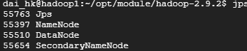

###  **1. Create Virtual Machine**

Hadoop-1 Settings:

1. Ubuntu 18.04 LTS
2. 100GB Hard disk
3. 8G RAM
4. 2 CPU core

###  **2. Firewall Settings**

Create a new rule to the inbound/ ingress. Only allow CUHK IP access VMs.


### **3. JDK Install**

1. Download jdk8 from Oracle, and import it into hadoop-1 virtual machine.


2. Extract it to `/opt/software`.

   ```shell
   tar -zxvf jdk-8u351-linux-x64.tar.gz -C opt/module/
   ```

   Then we get `jdk1.8.0_351` in `/opt/module`

   

   

3. Configure environment variables in `my_env.sh`.

   ```shell
   sudo vim /etc/profile.d/my_env.sh
   ```

   `my_env.sh` :

   ```shell
   #JAVA_HOME
   export JAVA_HOME=/home/dai_hk/opt/module/jdk1.8.0_351
   export PATH=$PATH:$JAVA_HOME/bin
   ```

4. Then, make the new environment variable effective.

   ```shell
   source /etc/profile
   ```

5. Check whether the JDK8 is installed successfully.

   ```shell
   java -version
   ```

   The following figure shows that the JDK installation was successful.

   

### **4. Hadoop Install**

1. Download `hadoop-2.9.2.tar.gz`


2. Extract it to `/opt/software`.

   ```shell
   tar -zxvf hadoop-2.9.2.tar.gz -C opt/module/
   ```

   Then we get `hadoop-2.9.2` in `/opt/module`

   

3. Configure environment variables in `my_env.sh`.

```shell
sudo vim /etc/profile.d/my_env.sh
```

​		`my_env.sh` :

```shell
#HADOOP_HOME
export HADOOP_HOME=/home/dai_hk/opt/module/hadoop-2.9.2
export PATH=$PATH:$HADOOP_HOME/bin
export PATH=$PATH:$HADOOP_HOME/sbin
```

4. Then, make the new environment variable effective.

```shell
source /etc/profile
```

5. Check whether the Hadoop is installed successfully.

```shell
hadoop
```

The following figure shows that the Hadoop installation was successful.


### **5. Single-node Hadoop Setup**

1. Modify ` etc/hadoop/core-site.xml`[1]:


2. Modify `etc/hadoop/hdfs-site.xml`:


3. Format the filesystem:

```shell
dai_hk@hadoop1:~/opt/module/hadoop-2.9.2$ hdfs namenode -format
```

4. Start NameNode daemon and DataNode daemon:

```shell
dai_hk@hadoop1:~/opt/module/hadoop-2.9.2$ start-dfs.sh
```

​			The following problems were found:


​			We need to modify JAVA_HOME path:

```shell
dai_hk@hadoop1:~/opt/module/hadoop-2.9.2/etc/hadoop$ vim hadoop-env.sh
```

​			Use Java path `/home/dai_hk/opt/module/jdk1.8.0_341` to exchange `${JAVA_HOME}`.

​			Then start namenode and datanode again.


​			Finally, use `jps` command to ensure setup successed.

```shell
jps
```

​			Setup result:



5. Visit website http://35.241.122.4:50070/.


​				Single hadoop cluster installation success.

### **6. Run Terasort Example**(Single Node)

1. Generate data for sort.

```shell
dai_hk@hadoop1:~/opt/module/hadoop-2.9.2$ hadoop jar ./share/hadoop/mapreduce/hadoop-mapreduce-examples-2.9.2.jar teragen 100000 terasort/input
```

​			Data generation success.


2. Terasort the generated data

```shell
dai_hk@hadoop1:~/opt/module/hadoop-2.9.2$ hadoop jar ./share/hadoop/mapreduce/hadoop-mapreduce-examples-2.9.2.jar terasort terasort/input terasort/output
```

​			Terasort done.


3. Validate the output is sorted.

```shell
dai_hk@hadoop1:~/opt/module/hadoop-2.9.2$ hadoop jar ./share/hadoop/mapreduce/hadoop-mapreduce-examples-2.9.2.jar teravalidate terasort/output terasort/check
```


###  **7. Multi-node Hadoop Cluster Setup**

1. Configure host name and IP address mapping.

```SHELL
sudo vim /etc/hostname
sudo vim /etc/hosts
```

`/etc/hosts`:


2. Realize SSH password free login.


​			Generate SSH key pairs, and add it to its own `authorized_keys`.

```shell
ssh-keygen -t rsa -P '' -f ~/.ssh/id_rsa
cat ~/.ssh/id_rsa.pub >> ~/.ssh/authorized_keys
chmod 0600 ~/.ssh/authorized_keys
```

​			ssh localhost succuess.


​			Get generated public key.

```shell
cat id_rsa.pub
```


​		Then, put hadoop1's public key into hadoop2's `authorized_keys`.

​		Finally, we can use hadoop2 connect to hadoop1.


​		*We need ensure every machine could connect each other.*

3. Cluster deployment planning.

|      | Hadoop1          | Hadoop2                         | Hadoop3     | Hadoop4     |
| ---- | :--------------- | ------------------------------- | ----------- | ----------- |
| HDFS | **NameNode**/2NN | DataNode                        | DataNode    | DataNode    |
| YARN |                  | **ResourceManager**/Nodemanager | NodeManager | NodeManager |

4. Modify configuration files.

`core-site.xml`:

```xml
<?xml version="1.0" encoding="UTF-8"?>
<?xml-stylesheet type="text/xsl" href="configuration.xsl"?>
<configuration>
 	<!-- 指定 NameNode 的地址 -->
 	<property>
 		<name>fs.defaultFS</name>
 		<value>hdfs://hadoop1:9000</value>
 	</property>
 	<!-- 指定 hadoop 数据的存储目录 -->
 	<property>
 		<name>hadoop.tmp.dir</name>
 		<value>/opt/module/hadoop-2.9.2/data</value>
 	</property>
 	<!-- 配置 HDFS 网页登录使用的静态用户为 dai_hk -->
 	<property>
 		<name>hadoop.http.staticuser.user</name>
 		<value>dai_hk</value>
 	</property>
</configuration>
```

`hdfs-site.xml`:

```xml
<?xml version="1.0" encoding="UTF-8"?>
<?xml-stylesheet type="text/xsl" href="configuration.xsl"?>
<configuration>
    <property>
        <name>dfs.replication</name>
        <value>3</value>
    </property>
    <property>
        <name>dfs.namenode.secondary.http-address</name>
        <value>hadoop1:50090</value>
    </property>
    <property>
        <name>dfs.namenode.secondary.https-address</name>
        <value>hadoop1:50091</value>
    </property>
</configuration>
```

`yarn-site.xml`:

```xml
<?xml version="1.0" encoding="UTF-8"?>
<?xml-stylesheet type="text/xsl" href="configuration.xsl"?>
<configuration>
 	<!-- 指定 MR 走 shuffle -->
 	<property>
 		<name>yarn.nodemanager.aux-services</name>
 		<value>mapreduce_shuffle</value>
 	</property>
 	<!-- 指定 ResourceManager 的地址-->
 	<property>
 		<name>yarn.resourcemanager.hostname</name>
 		<value>hadoop2</value>
 	</property>
</configuration>
```

`mapred-site.xml`:

```xml
<?xml version="1.0" encoding="UTF-8"?>
<?xml-stylesheet type="text/xsl" href="configuration.xsl"?>
<configuration>
	<!-- 指定 MapReduce 程序运行在 Yarn 上 -->
 	<property>
 		<name>mapreduce.framework.name</name>
 		<value>yarn</value>
 	</property>
</configuration>

```

`slaves`:

```xml
hadoop2
hadoop3
hadoop4
```

​	5. Then use command `rsync` copy file to hadoop2, hadoop3, hadoop4.

```shell
rsync -av /home/dai_hk/opt/module/hadoop-2.9.2/etc/hadoop/ dai_hk@hadoop4:/home/dai_hk/opt/module/hadoop-2.9.2/etc/hadoop/
```

6. Format name node.

```shell
hdfs namenode -format
```

7. Start HDFS and YARN.

```shel
start-hdfs.sh
start-yarn.sh
```

8. Enter hdfs system at `hadoop1:50070` in browser


9. Enter yarn system at `hadoop2:8088`.


10. Use `jps` to watch nodes situations.


### **8. Run Terasort Example**(Mutil Node)

1. Generate **2GB** data.

```shell
hadoop jar ./share/hadoop/mapreduce/hadoop-mapreduce-examples-2.9.2.jar teragen 21474836 terasort/input
```


2. Terasort **2GB** data.

```shel
hadoop jar ./share/hadoop/mapreduce/hadoop-mapreduce-examples-2.9.2.jar terasort terasort/input terasort/output
```

​		Running...


​	Using **1mins,49sec** finish task to sort 2GB data.


3. Generate **20GB** data.

```shell
hadoop jar ./share/hadoop/mapreduce/hadoop-mapreduce-examples-2.9.2.jar teragen 214748360 terasort/input
```

​		Generate...


​		Generated.


4. Terasort **20GB** data.

```shell
hadoop jar ./share/hadoop/mapreduce/hadoop-mapreduce-examples-2.9.2.jar terasort terasort/input terasort/output
```

​		Running...


​		Terasort finished. **4hr,24mins,47sec.**


### **9. Running the Python Code on Hadoop**

1. Start python code.

```shell
hadoop jar ./share/hadoop/tools/lib/hadoop-streaming-2.9.2.jar -file mapper.py -mapper mapper.py -file reducer.py -reducer reducer.py -input shakespeare -output output
```

2. Successed ! Use **19sec.**


### **10. Running the Java Code on Hadoop**

1. Creat java file, and put wordcount code in it.
2. Add environmental variables.

```shell
export JAVA_HOME=/usr/java/default
export PATH=${JAVA_HOME}/bin:${PATH}
export HADOOP_CLASSPATH=${JAVA_HOME}/lib/tools.jar
```

3. Complile `WordCount.java`. Generate jar file.

```shell
hadoop com.sun.tools.javac.Main WordCount.java
jar cf wc.jar WordCount*.class
```

4. Execute jar file.

```shell
hadoop jar wc.jar WordCount wordcount/input wordcount/output
```

​		Success ! Use **21sec.**


### **11. Python Running Time and Java Running Time**

Python code uses **19sec.**

Java code uses **21sec.**
