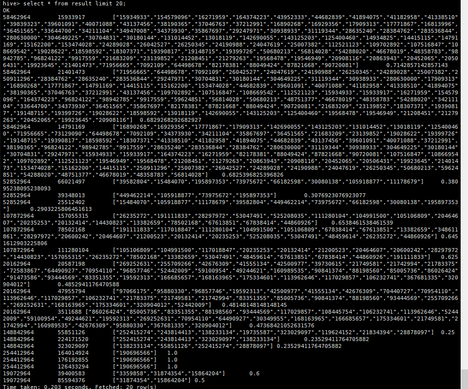
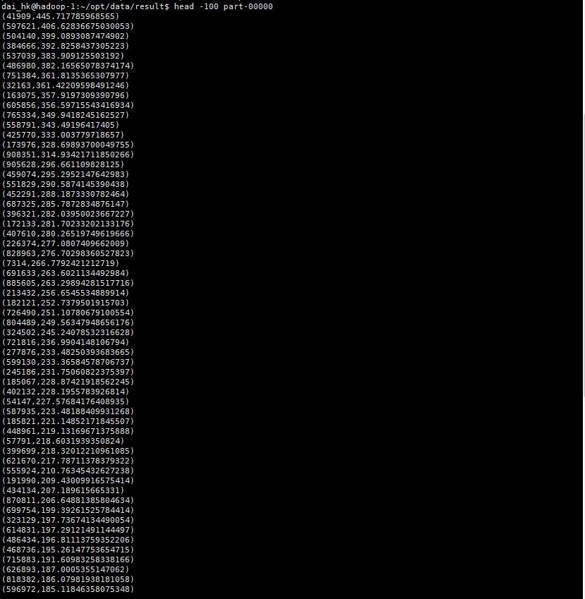

### Basic Operation of Pig

#### a. Pig Installation

​	Download Pig from Apache.

​	Unpack it.   2023/3/11 DAI Yayuan 1155182964

```shell
tar -xvf pig-0.17.0.tar.gz
```

​	Set environmental variables.

```shell
export PIG_HOME=/home/dai_hk/opt/module/pig-0.17.0
PATH=$PATH:$PIG_HOME/bin
```

  Use `-version` to check if Pig is installed.

```shell
pig -version
```

  Installation succeed.


#### b. Upload and join two datesets in HDFS.

​	Before joint.


​	Use hadoop command to join A to B.

```shell
hadoop fs -appendToFile /home/dai_hk/opt/data/googlebooks-eng-all-1gram-20120701-b/googlebooks-eng-all-1gram-20120701-b /data/googlebooks-eng-all-1gram-20120701-a/googlebooks-eng-all-1gram-20120701-a
```

After joint.


#### c. Compute avg of occurrences per year.

`pig`：

```pig
counts = LOAD '/data/googlebooks-eng-all-1gram-20120701-a/googlebooks-eng-all-1gram-20120701-a' as (bigram:chararray, year:chararray, match_count:double, volume_count:int);
grouped_counts = GROUP counts BY bigram;
result = FOREACH grouped_counts GENERATE group, SUM(counts.match_count) / COUNT(counts.match_count);
STORE result INTO '/data/occurrenceAvgNum';
```

​	Result tail:


#### d. Get top 20 bigram

```pig
counts = LOAD '/data/googlebooks-eng-all-1gram-20120701-a/googlebooks-eng-all-1gram-20120701-a' as (bigram:chararray, year:chararray, match_count:double, volume_count:int);
grouped_counts = GROUP counts BY bigram;
result = FOREACH grouped_counts GENERATE group, SUM(counts.match_count) / COUNT(counts.match_count);
order_result = ORDER result BY $1 DESC;
top20_order_result = LIMIT order_result 20;
STORE top20_order_result INTO '/data/top20Bigram'
```

​	Top 20 bigrams with the highest average number of occurrences:


### Basic Operations of Hive

apache-hive-2.3.9-bin

#### a. Hive Installation

​	Download Hive.

​	Unpack it.

​	Set environmental variables.


​	source it.

```shell
source /etc/profile.d
```

​	add follow setting to `hive-site.xml`:

```xml
<property>
    <name>system:java.io.tmpdir</name>
    <value>/home/dai_hk/opt/module/apache-hive-2.3.9-bin/iotempdir</value>
</property>
<property>
    <name>system:user.name</name>
    <value>dai_hk</value>
</property>
```

​	Installation success !


​	Initialize metstore.

```shell
bin/schematool -dbType derby -initSchema
```


#### b. Hive table initialization

​		Create hive table.


```sql
CREATE TABLE book_grams(
    bigram string,
    year string,
    match_count int,
    volume_count int
)
ROW FORMAT DELIMITED FIELDS TERMINATED BY '\t';
```

​		Put HDFS file into Hive database.

```sql
LOAD DATA INPATH '/data/book_grams/googlebooks-eng-all-1gram-20120701-a'
INTO TABLE book_grams;
```

​		Load data success.


#### c. Compute avg of occurrences per year

```sql
CREATE TABLE bigram_avg_occurs AS
(SELECT bigram, SUM(match_count)/COUNT(match_count) AS avg_occurs
FROM book_grams
GROUP BY bigram
ORDER BY avg_occurs DESC
LIMIT 20);
```

​		Start MapReduce task.


​		  Result:


#### d. Compared with pig

​		Hive spend 1mins,17sec on task.


​		Pig spend 4mins, 29sec on task.

 

### Community Detection in Online Social Networks using Pig

#### Task a

```sql
-- Step 1 加载并求出笛卡尔积
blog = LOAD '/data/medium/medium_relation' USING PigStorage(' ')  AS (followee:chararray, follower:chararray);
blog_grpd = GROUP blog BY followee;
blog_grpd_dbl = FOREACH blog_grpd GENERATE group, blog.follower AS blog1, blog.follower AS blog2;
cofollow = FOREACH blog_grpd_dbl GENERATE group, FLATTEN(blog1) as blog1, FLATTEN(blog2) as blog2;
cofollow_filtered = FILTER cofollow BY blog1 < blog2;
-- Step 2 汇总共同关注的blog及数目
grpd_cofollow_filtered = GROUP cofollow_filtered BY (blog1, blog2);
co_followee = FOREACH grpd_cofollow_filtered GENERATE FLATTEN(group), cofollow_filtered.group AS co_followees, COUNT(cofollow_filtered) AS co_nums; 
-- Step 3
-- 根据左侧blog找出其最大共同关注数
grpd_cofollowee_left = GROUP co_followee BY blog1;
max_co_follower_left = FOREACH grpd_cofollowee_left GENERATE group, MAX(co_followee.co_nums) AS max_nums;
-- dump max_co_follower_left;

-- 根据右侧blog找出其最大共同关注数
grpd_cofollowee_right = GROUP co_followee BY blog2;
max_co_follower_right = FOREACH grpd_cofollowee_right GENERATE group, MAX(co_followee.co_nums) AS max_nums;
-- dump max_co_follower_right;

-- Step 4
-- 连接左右两表后，取最大值,找到了单个博客最大共同关注的个数
mix_max = UNION max_co_follower_left, max_co_follower_right;
grpd_mix_max = GROUP mix_max BY group;
union_mix_max = FOREACH grpd_mix_max GENERATE group AS blog, MAX(mix_max.max_nums) as max_co_fol;
-- dump union_mix_max;

-- Step 5
-- 将最大值表和co_followee表进行合并，然后将不是最大值的组合进行过滤
C = JOIN union_mix_max BY blog, co_followee BY blog1; 
D = FILTER C BY max_co_fol == co_nums;
-- dump D;

E = JOIN union_mix_max BY blog, co_followee BY blog2;
F = FILTER E BY max_co_fol == co_nums;
-- dump F;

G = UNION D, F;

-- Step 6
-- 按固定格式输出
H = FOREACH G GENERATE blog, CONCAT(CONCAT(blog1,':'),blog2) AS blog_pair, co_followees, co_nums;
I = FILTER H BY blog matches '.*2964';
dump I;
--STORE I INTO '/data/co_followees';
```

​	Assume input example:

​					

​	After above **step 1**, we get:


​	It means 2, 4 common follow 1.  2, 5 common follow 3.

​	Then after **step** **2**, we get follow result:


​	{group::blog1: chararray,group::blog2: chararray,co_followee: {(group: chararray)},co_nums: long}

​	it means 1 ,2 common follow 5 and 3. 1, 2 have two common followees

​	**Step 5 ：**


​	Filter result by '2964' condition, reformat it to new format:


#### Task b


```sql
-- Step 1 加载并求出笛卡尔积
blog = LOAD '/data/medium/medium_relation' USING PigStorage(' ')  AS (followee:chararray, follower:chararray);
blog_grpd = GROUP blog BY followee;
blog_grpd_dbl = FOREACH blog_grpd GENERATE group, blog.follower AS blog1, blog.follower AS blog2;
cofollow = FOREACH blog_grpd_dbl GENERATE group, FLATTEN(blog1) as blog1, FLATTEN(blog2) as blog2;
cofollow_filtered = FILTER cofollow BY blog1 < blog2;

-- 求出每个blog关注对象的个数
grpd_blog = GROUP blog BY follower;
followee_count = FOREACH grpd_blog GENERATE group AS blog, COUNT(blog.followee) AS followee;

-- Step 2 汇总共同关注的blog及数目
grpd_cofollow_filtered = GROUP cofollow_filtered BY (blog1, blog2);
co_followee = FOREACH grpd_cofollow_filtered GENERATE FLATTEN(group), cofollow_filtered.group AS co_followees, COUNT(cofollow_filtered) AS co_nums; 

-- 求similarity
CC = JOIN co_followee BY blog1, followee_count BY blog;
DD = JOIN CC BY blog2, followee_count BY blog;
EE = FOREACH DD GENERATE $0 AS blog1, $1 AS blog2, $2 AS co_followees, ((DOUBLE)$3 / (DOUBLE)($5 + $7 - $3)) AS similarity;

-- 根据左侧找出top3
FF = GROUP EE BY blog1;
top3_left = FOREACH FF {
	sorted = ORDER EE BY similarity DESC;
	top = LIMIT sorted 3;
	GENERATE group, FLATTEN(top);
};

-- 根据右侧找出top3
GG = GROUP EE BY blog2;
top3_right = FOREACH GG {
	sorted = ORDER EE BY similarity DESC;
	top = LIMIT sorted 3;
	GENERATE group, FLATTEN(top);
};

-- 合并之后可能会超过三个
topN = UNION top3_left, top3_right;

-- 再次取top3个
grpd_topN = GROUP topN BY group;
top3 = FOREACH grpd_topN {
	sorted = ORDER topN BY similarity DESC;
	top = LIMIT sorted 3;
	GENERATE FLATTEN(top);
};

format_result = FOREACH top3 GENERATE group, CONCAT(CONCAT(blog1,':'),blog2) AS blog_pair, co_followees, similarity;

-- 过滤结果
result = FILTER top3 BY group matches '.*2964';
STORE result INTO '/data/top3_co_followees';

dump result;
```


​	Base task A, calculate similarity.


​	Get top 3 pair by blog number. 

​	Filter result by condition "2964" tail.


#### Task c

​		1. Create table in Hive database.

```sql
create table blog_relation(followee_id string, follower_id string)
ROW FORMAT DELIMITED FIELDS TERMINATED BY ' ';
```

​		2. Load sample data into table.

```sql
create table blog_relation(followee_id string, follower_id string)
ROW FORMAT DELIMITED FIELDS TERMINATED BY ' ';
```

​	

​	3. Calculate every blog's followee number.

```sql
create table followee_num as 
select follower_id, count(*) as followee_nums
from blog_relation
group by follower_id;
```


​	4. Get follow format Cartesian product.

```sql
create table followers as 
select a.followee_id as followee_id, a.follower_id as follower_1, b.follower_id as follower_2
from blog_relation as a join blog_relation as b
on a.followee_id = b.followee_id
where a.follower_id != b.follower_id
;
```


  		5. Find common followees between two blog.

```sql
create table co_followees as
select follower_1, follower_2, collect_list(followers.followee_id) as co_followee, count(*) as co_fol_nums
from followers
group by follower_1, follower_2;
```


  		6. Calculate two blog's similarity.

```sql
create table blog_pair_similarity as 
select A.follower_1 as follower_1, A.follower_2 as follower_2, A.co_followee as co_followee, (A.co_fol_nums / (B.followee_nums + C.followee_nums - A.co_fol_nums)) as similarity
from co_followees as A
join followee_num as B on A.follower_1 = B.follower_id
join followee_num as C on A.follower_2 = C.follower_id;
```


 	7. For every blog, choose top 3 most similar blog pairs.

```sql
create table top3 as 
select * 
from (select * , row_number() over(partition by follower_1 order by similarity desc) as rank from blog_pair_similarity) as a
where a.rank < 4;
```


8. Use above code to process medium data.

```sql
create table result as 
select follower_1, follower_2, co_followee, similarity
from top3
where follower_1 like '%2964';
```

​		Part result :




### Spark Basic RDD

#### Environment set

​		Set environment variables.

`my-env.sh`:

```shell
export SPARK_HOME=/home/dai_hk/opt/module/spark-3.0.0-bin-hadoop2.7
export PATH=$SPARK_HOME/bin:$PATH
```

`spark-env.sh`:

```xm
export JAVA_HOME=/home/dai_hk/opt/module/jdk1.8.0_341
YARN_CONF_DIR=/home/dai_hk/opt/module/hadoop-2.9.2/etc/hadoop
```

​		Use follow maven settings.

`pom.xml`

```xml
<?xml version="1.0" encoding="UTF-8"?>
<project xmlns="http://maven.apache.org/POM/4.0.0"
         xmlns:xsi="http://www.w3.org/2001/XMLSchema-instance"
         xsi:schemaLocation="http://maven.apache.org/POM/4.0.0 http://maven.apache.org/xsd/maven-4.0.0.xsd">
    <parent>
        <artifactId>dai_spark</artifactId>
        <groupId>org.example</groupId>
        <version>1.0-SNAPSHOT</version>
    </parent>
    <modelVersion>4.0.0</modelVersion>

    <artifactId>spark-core</artifactId>

    <properties>
        <maven.compiler.source>18</maven.compiler.source>
        <maven.compiler.target>18</maven.compiler.target>
    </properties>
    <dependencies>
        <dependency>
            <groupId>org.apache.spark</groupId>
            <artifactId>spark-core_2.12</artifactId>
            <version>3.0.0</version>
        </dependency>
    </dependencies>
    <build>
        <plugins>
            <!-- 该插件用于将 Scala 代码编译成 class 文件 -->
            <plugin>
                <groupId>net.alchim31.maven</groupId>
                <artifactId>scala-maven-plugin</artifactId>
                <version>3.2.2</version>
                <executions>
                    <execution>
                        <!-- 声明绑定到 maven 的 compile 阶段 -->
                        <goals>
                            <goal>testCompile</goal>
                        </goals>
                    </execution>
                </executions>
            </plugin>
            <plugin>
                <groupId>org.apache.maven.plugins</groupId>
                <artifactId>maven-assembly-plugin</artifactId>
                <version>3.1.0</version>
                <configuration>
                    <descriptorRefs>
                        <descriptorRef>jar-with-dependencies</descriptorRef>
                    </descriptorRefs>
                </configuration>
                <executions>
                    <execution>
                        <id>make-assembly</id>
                        <phase>package</phase>
                        <goals>
                            <goal>single</goal>
                        </goals>
                    </execution>
                </executions>
            </plugin>
        </plugins>
    </build>
</project>
```

#### task a

​		Write scala code.

`PageRank.scala`:

```scala
package com.dai.bigdata.spark.core

import org.apache.spark.rdd.RDD
import org.apache.spark.{HashPartitioner, SparkConf, SparkContext}

object PageRank {

  def main(args: Array[String]): Unit = {

    val sparkConf = new SparkConf().setAppName("PageRank")
    val sc = new SparkContext(sparkConf)

    // 读取文件
    // 也可以是HDFS路径
    val fileRDD: RDD[String] = sc.textFile("hdfs://hadoop1:50070/data/pagerank-data/web-Google.txt").persist()

    // 将page分隔后，生成rank记录表 保存rank分数，每行为一个page，rank默认为1
    val pageRDD: RDD[String] = fileRDD.flatMap(_.split("\t"))
    var ranks : RDD[(String, Double)] = pageRDD.distinct().map {(_, 1.0)}
    // 将每一列构建成一组k-v对: from - List(To)
    val pagePair = fileRDD.map { line =>
      val token = line.split("\t")
      (token(0), List(token(1)))
    }.distinct()

    // 按fromPage为key进行聚合，value通过:::进行List的追加
    val links : RDD[(String, List[String])] = pagePair.reduceByKey(_:::_).partitionBy(new HashPartitioner(10)).persist()
    for (_ <- 0 until 10) {
      val contributions :RDD[(String, Double)] = links.join(ranks).flatMap{
        case (_, (links, rank)) =>
          links.map(dest => (dest, rank / links.size))
      }
      ranks = contributions.reduceByKey((x,y) => x + y).mapValues(v => 0.15 + 0.85 * v)
    }
    // 结果按value的降序保存到文件
    ranks.sortBy(f => f._2, false).saveAsTextFile("result")
  }
}
```

​	Pack scala code to .jar and submit it to spark cluster.

```shell
bin/spark-submit \
--class com.dai.bigdata.spark.core.PageRank \
--master yarn \
--deploy-mode cluster \
./home/dai_hk/spark-core-1.0.SNAPSHOT.jar
```

​	Get top 100 pages.




#### task b 

​		When building RDD or reading files, you can specify the number of partitions, and then Spark will perform parallel calculations based on the number of partitions.

```scala
//Set the number of partitions to 4 when reading from memory
SparkContect.makeRDD (List (1,2,3,4), 4)
//Set the number of partitions to 2 when reading a file
sc.textFile ("filePath", minPartitions=2)
```

​		When the number of partitions is not transferred, the number of partitions defaultParallelism will be arranged by default.

```scala
defaultParallelism = total.Cores
```

​		Because VMs core is 2 CPUs, the defaultParallelism will be 2.


	Finally, several files of the partition will be output.

​		Using **partitionNum** to set partitions number.

```java
package com.dai.bigdata.spark.core

import org.apache.spark.rdd.RDD
import org.apache.spark.{HashPartitioner, SparkConf, SparkContext}

object PageRank {

  def main(args: Array[String]): Unit = {

    val sparkConf = new SparkConf().setAppName("PageRank-2")
    val sc = new SparkContext(sparkConf)
    //分区数 2 / 8 / 16
    val partitionNum = 2
    // 读取文件
    // 也可以是HDFS路径
    val fileRDD: RDD[String] = sc.textFile("HDFS://hadoop1:50070/data/pagerank-data", partitionNum).persist()

    // 将page分隔后，生成rank记录表 保存rank分数，每行为一个page，rank默认为1
    val pageRDD: RDD[String] = fileRDD.flatMap(_.split("\t"))
    var ranks: RDD[(String, Double)] = pageRDD.distinct().map {
      (_, 1.0)
    }
    // 将每一列构建成一组k-v对: from - List(To)
    val pagePair = fileRDD.map { line =>
      val token = line.split("\t")
      (token(0), List(token(1)))
    }.distinct()

    // 按fromPage为key进行聚合，value通过:::进行List的追加
    val links: RDD[(String, List[String])] = pagePair.reduceByKey(_ ::: _).partitionBy(new HashPartitioner(10)).persist()
    for (_ <- 0 until 10) {
      val contributions: RDD[(String, Double)] = links.join(ranks).flatMap {
        case (_, (links, rank)) =>
          links.map(dest => (dest, rank / links.size))
      }
      ranks = contributions.reduceByKey((x, y) => x + y).mapValues(v => 0.15 + 0.85 * v)
    }
    // 结果按value的降序保存到文件
    ranks.sortBy(f => f._2, false).saveAsTextFile("result")
  }
}
```

​		Modify different partitions number like **2 / 8 / 16**.

​		Then submit it to cluster.

```java
spark-submit \
--class com.dai.bigdata.spark.core.PageRank#main \
--master yarn \
--deploy-mode cluster \
../../../../spark-core-1.0-SNAPSHOT.jar
```

​		`numPartitions=2`: 1.3min


​		`numPartitions=8`: 1.2min


​		`numPartitions=16`: 59s


​		With the increase of the number of partitions, the parallel computing capacity has been improved, but the improvement is priority. Therefore, when choosing CPU resources and speed, we need to weigh them.
