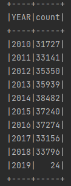

[TOC]

## Q1 Crime Incidents Count

#### a, b)  

1. **Put `Crime_Incidents_in_2013.csv` into HDFS**
2. **Then use Spark SQL read it.**
3. **Using Spark DSL to solve problem (a) and (b), then store it into new `.csv` file as follow.**

```scala
import org.apache.spark.SparkConf
import org.apache.spark.sql.SparkSession

object CrimeDataProcess {
  def main(args: Array[String]): Unit = {
    // 构建环境，加载文件
    val conf : SparkConf = new SparkConf().setMaster("local[*]").setAppName("Crime_Analysis")
    val spark : SparkSession = SparkSession.builder().config(conf).getOrCreate()
    val file = spark.read.option("header",true).csv("C:\\Users\\Administrator\\Desktop\\Big-Data-Systems-and-Information-Processing\\4.KafkaSparkStreaming\\data\\Crime_Incidents_in_2013.csv")
    
    // task A
    val filteredData = file.select("CCN", "REPORT_DAT", "OFFENSE", "METHOD", "END_DATE", "DISTRICT").filter("END_DATE is not null and CCN is not null and REPORT_DAT is not null and OFFENSE is not null and METHOD is not null and DISTRICT is not null")
    filteredData.write.csv("/data/Filtered_Crime_Incidents_in_2013.csv")
    
    // task B
    val offenseCount = file.groupBy("OFFENSE").count()
    offenseCount.write.csv("/data/offenseCount.csv")
    val timeCount = file.groupBy("SHIFT").count()
    timeCount.write.csv("/data/timeCount.csv")
    spark.close()
  }
}
```

4. **Pack it to `.jar` file, and then submit it to Spark - Yarn Cluster.**

`pom.xml`:

```xml
<?xml version="1.0" encoding="UTF-8"?>
<project xmlns="http://maven.apache.org/POM/4.0.0"
         xmlns:xsi="http://www.w3.org/2001/XMLSchema-instance"
         xsi:schemaLocation="http://maven.apache.org/POM/4.0.0 http://maven.apache.org/xsd/maven-4.0.0.xsd">
    <modelVersion>4.0.0</modelVersion>
    <groupId>com.dai</groupId>
    <artifactId>SparkSql</artifactId>
    <version>1.0-SNAPSHOT</version>
    <properties>
        <maven.compiler.source>18</maven.compiler.source>
        <maven.compiler.target>18</maven.compiler.target>
    </properties>

    <dependencies>
        <dependency>
            <groupId>org.apache.spark</groupId>
            <artifactId>spark-core_2.12</artifactId>
            <version>3.0.0</version>
        </dependency>
        <dependency>
            <groupId>org.apache.spark</groupId>
            <artifactId>spark-sql_2.12</artifactId>
            <version>3.0.0</version>
        </dependency>
    </dependencies>
    <build>
        <plugins>
            <plugin>
                <artifactId>maven-assembly-plugin</artifactId>
                <configuration>
                    <archive>
                        <manifest>
                            <addClasspath>true</addClasspath>
                            <!--下面必须指定好主类 如com.my.Main --><mainClass>com.dai.CrimeDataProcess</mainClass>
                        </manifest>
                    </archive>
                    <descriptorRefs>
                        <descriptorRef>jar-with-dependencies</descriptorRef>
                    </descriptorRefs>
                </configuration>
            </plugin>
            <plugin>
                <groupId>org.apache.maven.plugins</groupId>
                <artifactId>maven-compiler-plugin</artifactId>
                <configuration>
                    <source>8</source>
                    <target>8</target>
                </configuration>
            </plugin>
            <plugin>
                <groupId>net.alchim31.maven</groupId>
                <artifactId>scala-maven-plugin</artifactId>
                <version>3.2.1</version>
                <executions>
                    <execution>
                        <id>scala-compile-first</id>
                        <phase>process-resources</phase>
                        <goals>
                            <goal>add-source</goal>
                            <goal>compile</goal>
                        </goals>
                    </execution>
                </executions>
            </plugin>
        </plugins>
    </build>
</project>
```

```shell
spark-submit \
--class com.dai.CrimeDataProcess \
--master yarn \
--deploy-mode cluster \
../../../jars/SparkSql-1.0-SNAPSHOT.jar
```

​	Then after task success.


5. **Our target result file was stored into HDFS.**


**`Filtered_Crime_Incidents_in_2013.csv`:**


**`offenseCount.csv`:**


**`timeCount.csv`:**


#### c)

`code`:

```scala
package com.dai
import org.apache.spark.SparkConf
import org.apache.spark.sql.SparkSession
import org.apache.spark.sql.functions.substring
object NineYearCrimeDataProcess {
  def main(args: Array[String]): Unit = {
    val conf: SparkConf = new SparkConf().setAppName("Crime_Analysis")
    val spark: SparkSession = SparkSession.builder().config(conf).getOrCreate()
    val data_2010 = spark.read.option("header", value = true).csv("/data/Crime_Incidents_in_2010.csv")
    val data_2011 = spark.read.option("header", value = true).csv("/data/Crime_Incidents_in_2011.csv")
    val data_2012 = spark.read.option("header", value = true).csv("/data/Crime_Incidents_in_2012.csv")
    val data_2013 = spark.read.option("header", value = true).csv("/data/Crime_Incidents_in_2013.csv")
    val data_2014 = spark.read.option("header", value = true).csv("/data/Crime_Incidents_in_2014.csv")
    val data_2015 = spark.read.option("header", value = true).csv("/data/Crime_Incidents_in_2015.csv")
    val data_2016 = spark.read.option("header", value = true).csv("/data/Crime_Incidents_in_2016.csv")
    val data_2017 = spark.read.option("header", value = true).csv("/data/Crime_Incidents_in_2017.csv")
    val data_2018 = spark.read.option("header", value = true).csv("/data/Crime_Incidents_in_2018.csv")
    // 合并表
    val mergedData = data_2010.union(data_2011).union(data_2012).union(data_2013).union(data_2014).union(data_2015).union(data_2016).union(data_2017).union(data_2018)
    val timeMethod = mergedData.select(substring(mergedData("REPORT_DAT"),0, 4) as("YEAR"), mergedData("METHOD"))
    // 计算每年总crime数
    val yearlyCrimeNums = timeMethod.groupBy("YEAR").count().orderBy("YEAR")
    // 修改count列名
    val newYearlyCrimeNums = yearlyCrimeNums.select(yearlyCrimeNums("YEAR") as ("YEAR_"), yearlyCrimeNums("count") as("total_crime_count"))
    // 计算每年gun crime次数
    val yearlyGunCrimeNums = timeMethod.groupBy("YEAR", "METHOD").count().select("YEAR","count").where("METHOD == 'GUN'")
    // 将两表join
    val joined_table = newYearlyCrimeNums.join(yearlyGunCrimeNums, newYearlyCrimeNums("YEAR_") === yearlyGunCrimeNums("YEAR"), "inner")
    // 计算percentage
    val result = joined_table.select(joined_table("YEAR"), joined_table("count") / joined_table("total_crime_count") as("gun_percentage")).orderBy("YEAR")
    result.show()
    spark.close()
  }
}
```

1. **Merge 9 tables into one.**

2. **Get `Method` and `Year` from data.**

```scala
val time_method = merged_data.select(substring(merged_data("REPORT_DAT"),0, 4) as("YEAR"), merged_data("METHOD"))
```


3. **Get total crime numbers of every year.**

```scala
val yearlyCrimeNums = timeMethod.groupBy("YEAR").count().orderBy("YEAR")
```




4. **Get gun crime numbers of ever year.**

   ```scala
    val yearlyGunCrimeNums = timeMethod.groupBy("YEAR", "METHOD").count().select("YEAR","count").where("METHOD == 'GUN'")
   ```

   

5. **Join two table on same `YEAR`.**

   ```scala
   val joined_table = newYearlyCrimeNums.join(yearlyGunCrimeNums, newYearlyCrimeNums("YEAR_") === yearlyGunCrimeNums("YEAR"), "inner")
   ```

   


6. **Pack code and submit it into Spark Cluster, then we get percentage of gun using.**

   ```scala
   val result = joined_table.select(joined_table("YEAR"), joined_table("count") / joined_table("total_crime_count") as("gun_percentage")).orderBy("YEAR")
   ```

   submit :

   ```shell
   spark-submit \
   --class com.dai.NineYearCrimeDataProcess \
   --master yarn \
   --deploy-mode cluster \
   ../../../jars/NineYearCrimeDataProcess-1.0-SNAPSHOT.jar
   ```

   

7. **Therefore, we found that after Obama took office, the rate of armed crime has been steadily declining.**

## Q2 Kafka Cluster Setup

| Hadoop3   | Hadoop4   |
| --------- | --------- |
| Zookeeper | Zookeeper |
| Kafka     | Kafka     |

1. **Download Kafka and unzip it.**

2. **Then add settings `server.properties`.**

   Hadoop3 - broker.id = 1 and Hadoop4 - broker.id = 2

   ```properties
   broker.id=1/2
   zookeeper.connect=hadoop3:2181,hadoop4:2181/kafka
   ```

3. **Modify environmental variables.**

```shell
#KAFKA_HOME
export KAFKA_HOME=/opt/module/kafka
export PATH=$PATH:$KAFKA_HOME/bin
```

 4. **Setup Zookeeper Cluster.**

    - set myid in every linux differently.
    - modify `zoo.cfg`

    ```xml
    dataDir=/home/dai_hk/opt/module/apache-zookeeper-3.5.7-bin/zkData
    server.3=hadoop3:2888:3888
    server.4=hadoop4:2888:3888
    ```

    - vim environmental variables

    ```shell
    export ZOO_HOME=/home/dai_hk/opt/module/apache-zookeeper-3.5.7-bin
    export PATH=$PATH:$ZOO_HOME/bin
    ```

    - start zookeeper service successed.

    

5. **Start Kafka Cluster respectively.**

```shell
kafka-server-start.sh -daemon config/server.properties
```

​	hadoop3 :


​	hadoop4 :


6. **Create topic**

```shell
kafka-topics.sh --bootstrap-server hadoop3:9092 --create --partitions 2 --replication-factor 2 --topic my-test-topic
```


7. **See the details of the topic.**

```shell
kafka-topics.sh --bootstrap-server hadoop3:9092 --describe --topic my-test-topic
```


8. **Send message.**

```shell
kafka-console-producer.sh --broker-list hadoop3:9092 --topic my-test-topic
```


9. **Consume message.**

```shell
kafka-console-consumer.sh --bootstrap-server hadoop3:9092 --from-beginning --topic my-test-topic
```


## Q3 Most Frequent Hashtags with Spark RDD Streaming

#### a)  

1. **Create new topic called `bitcoin`**

```shell
kafka-topics.sh --bootstrap-server hadoop3:9092 --create --partitions 2 --replication-factor 2 --topic bitcoin
```


2. **Write Kafka producer.**

```python
#coding=utf-8
import os
import time
# 取出时间中的秒数
def convert_to_seconds(ts):
    second = ts[-2:]
    return second
def main():
    last_ts = None
    with open("C:\Users\Administrator\Desktop\Big-Data-Systems-and-Information-Processing\4.KafkaSparkStreaming\data\new_tweets.txt") as f:
        for line in f:
            # 划分文本和时间戳
            parts = line.rstrip().split(',')
            text = ' '.join(parts[:-1])
            ts = parts[-1]
            # 当前推文时间戳
            ts = convert_to_seconds(ts)
            # 向Kafka生产者发送消息
            cmd = 'echo "' + text + '" | kafka-console-producer.sh --broker-list hadoop3:9092 --topic bitcoin'
            os.system(cmd)
            # 模拟时间间隔
            if last_ts is not None:
                # 进程睡眠两个推文之间的时间间隔 最多五秒
                time.sleep(abs(int(ts) - int(last_ts)) % 5)
            last_ts = ts
if __name__ == '__main__':
    main()
```

3. **Run python producer in hadoop3**

```shell
python kafka_producer.py
```


3. **Get Message from Kafka consumer over time.**


#### b)


