# Big-Data-Systems-and-Information-Processing

## 1. Hadoop Cluster Setup


### **Create Virtual Machine**

Hadoop-1 Settings:

1. Ubuntu 18.04 LTS
2. 100GB Hard disk
3. 8G RAM
4. 2 CPU core

### **Firewall Settings**

Create a new rule to the inbound/ ingress. Only allow CUHK IP access VMs.


### **JDK Install**

1. Download jdk8 from Oracle, and import it into hadoop-1 virtual machine.


2. Extract it to `/opt/software`.

   ```shell
   tar -zxvf jdk-8u351-linux-x64.tar.gz -C opt/module/
   ```

   Then we get `jdk1.8.0_351` in `/opt/module`

   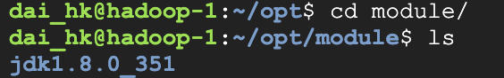

   

3. Configure environment variables in `my_env.sh`.

   ```shell
   sudo vim /etc/profile.d/my_env.sh
   ```

   `my_env.sh` :

   ```shell
   #JAVA_HOME
   export JAVA_HOME=/home/dai_hk/opt/module/jdk1.8.0_351
   export PATH=$PATH:$JAVA_HOME/bin
   ```

4. Then, make the new environment variable effective.

   ```shell
   source /etc/profile
   ```

5. Check whether the JDK8 is installed successfully.

   ```shell
   java -version
   ```

   The following figure shows that the JDK installation was successful.

   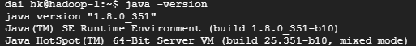

### **Hadoop Install**

1. Download `hadoop-2.9.2.tar.gz`


2. Extract it to `/opt/software`.

   ```shell
   tar -zxvf hadoop-2.9.2.tar.gz -C opt/module/
   ```

   Then we get `hadoop-2.9.2` in `/opt/module`

   

3. Configure environment variables in `my_env.sh`.

```shell
sudo vim /etc/profile.d/my_env.sh
```

​		`my_env.sh` :

```shell
#HADOOP_HOME
export HADOOP_HOME=/home/dai_hk/opt/module/hadoop-2.9.2
export PATH=$PATH:$HADOOP_HOME/bin
export PATH=$PATH:$HADOOP_HOME/sbin
```

4. Then, make the new environment variable effective.

```shell
source /etc/profile
```

5. Check whether the Hadoop is installed successfully.

```shell
hadoop
```

The following figure shows that the Hadoop installation was successful.

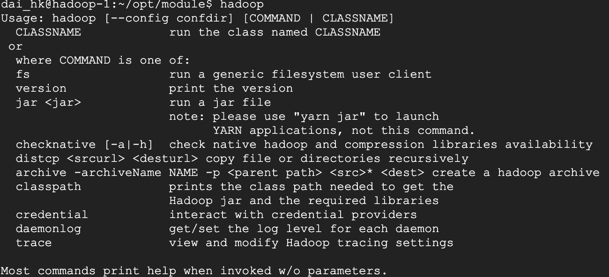

### **Single-node Hadoop Setup**

1. Modify ` etc/hadoop/core-site.xml`[1]:

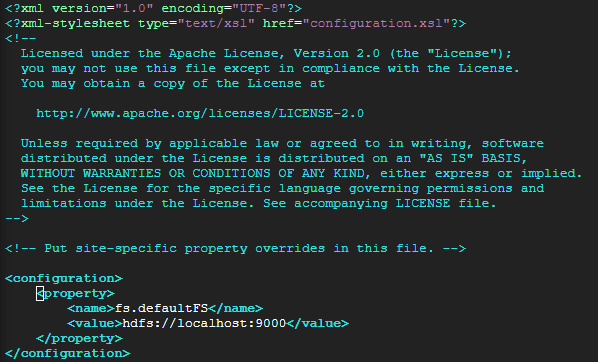

2. Modify `etc/hadoop/hdfs-site.xml`:

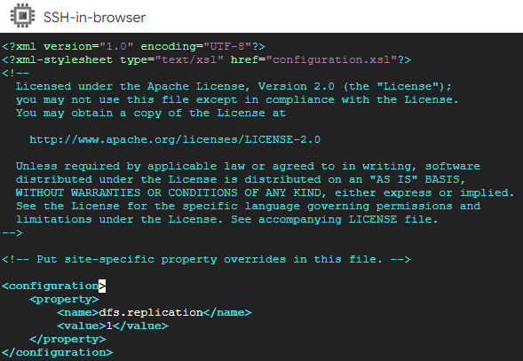

3. Format the filesystem:

```shell
dai_hk@hadoop1:~/opt/module/hadoop-2.9.2$ hdfs namenode -format
```

4. Start NameNode daemon and DataNode daemon:

```shell
dai_hk@hadoop1:~/opt/module/hadoop-2.9.2$ start-dfs.sh
```

​			The following problems were found:

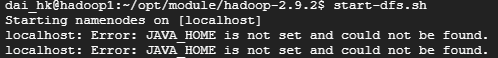

​			We need to modify JAVA_HOME path:

```shell
dai_hk@hadoop1:~/opt/module/hadoop-2.9.2/etc/hadoop$ vim hadoop-env.sh
```

​			Use Java path `/home/dai_hk/opt/module/jdk1.8.0_341` to exchange `${JAVA_HOME}`.

​			Then start namenode and datanode again.

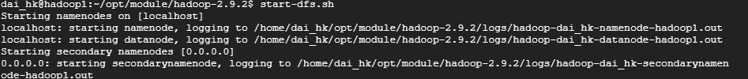

​			Finally, use `jps` command to ensure setup successed.

```shell
jps
```

​			Setup result:

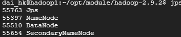

5. Visit website http://35.241.122.4:50070/.

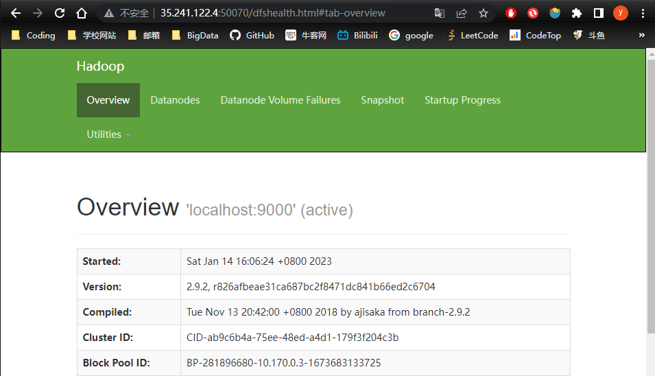

​				Single hadoop cluster installation success.

### **Run Terasort Example**

1. Generate data for sort.

```shell
dai_hk@hadoop1:~/opt/module/hadoop-2.9.2$ hadoop jar ./share/hadoop/mapreduce/hadoop-mapreduce-examples-2.9.2.jar teragen 100000 terasort/input
```

​			Data generation success.

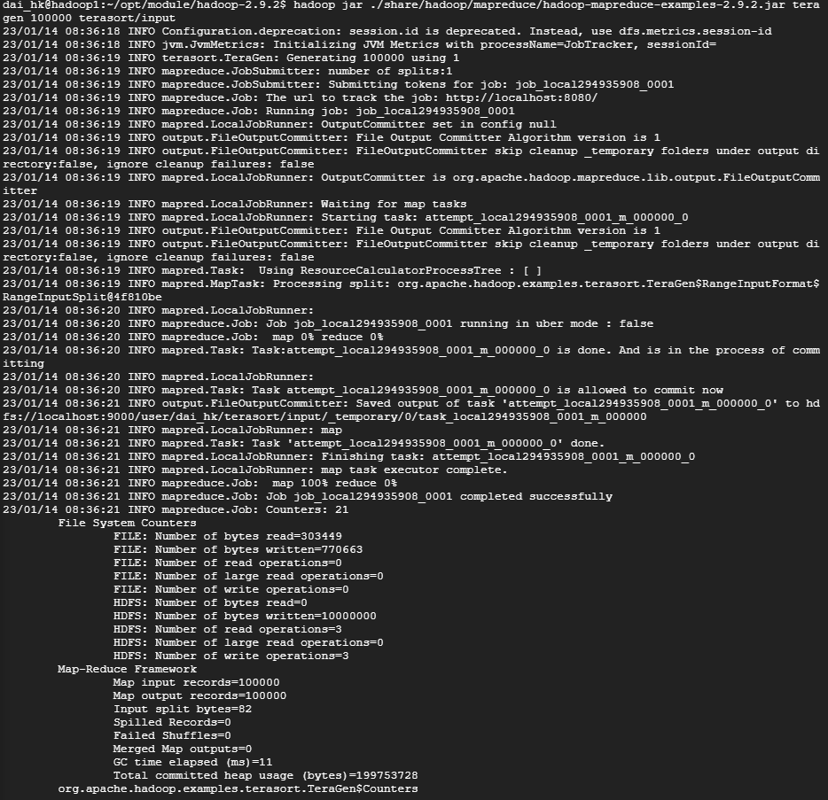

2. Terasort the generated data

```shell
dai_hk@hadoop1:~/opt/module/hadoop-2.9.2$ hadoop jar ./share/hadoop/mapreduce/hadoop-mapreduce-examples-2.9.2.jar terasort terasort/input terasort/output
```

​			Terasort done.

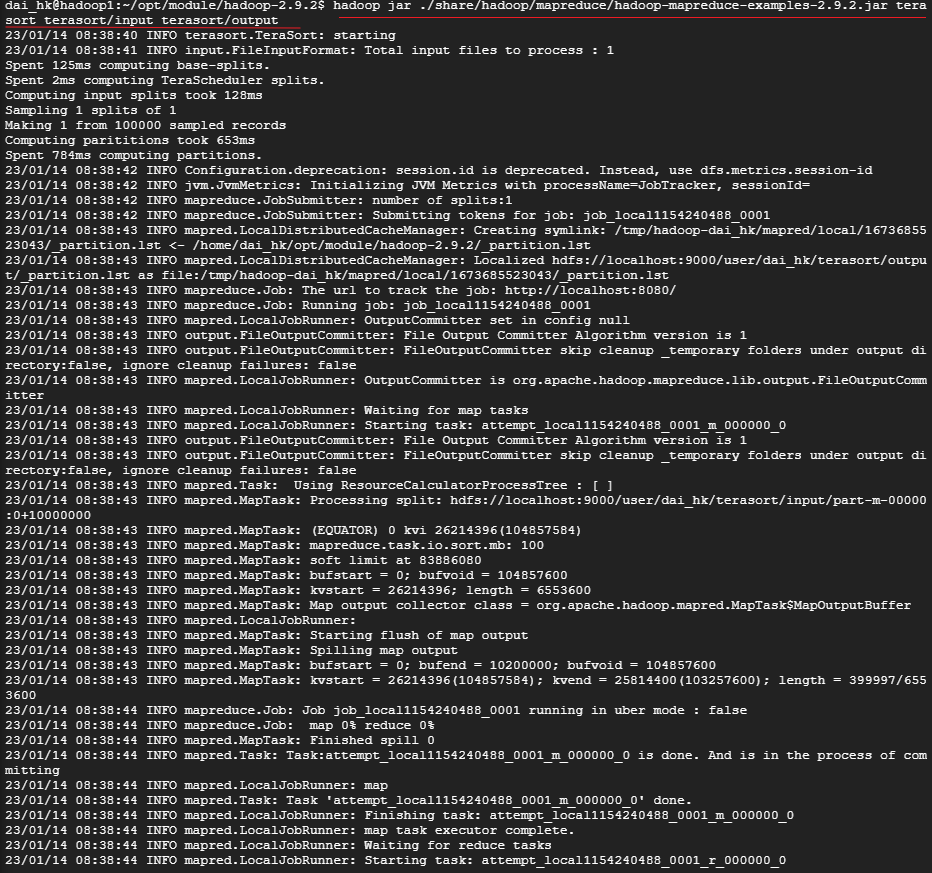

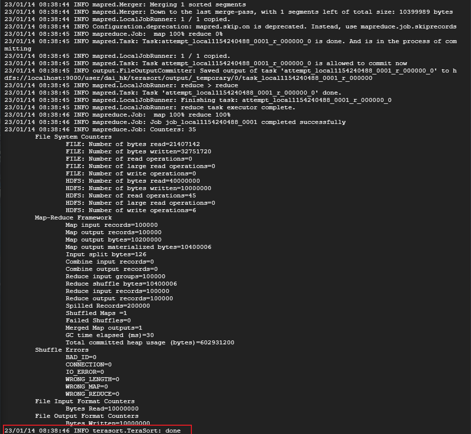

3. Validate the output is sorted.

```shell
dai_hk@hadoop1:~/opt/module/hadoop-2.9.2$ hadoop jar ./share/hadoop/mapreduce/hadoop-mapreduce-examples-2.9.2.jar teravalidate terasort/output terasort/check
```


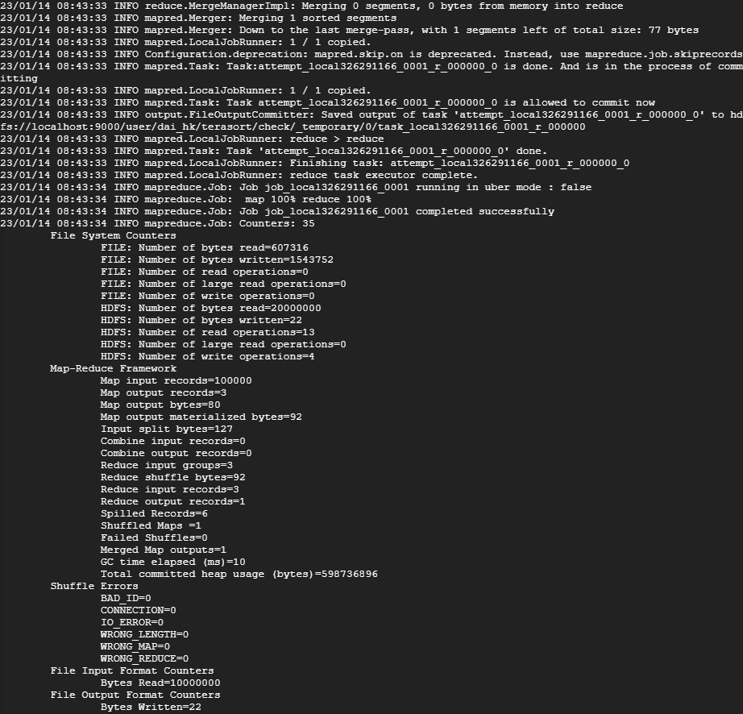

###  **Multi-node Hadoop Cluster Setup**

1. Configure host name and IP address mapping.

```SHELL
sudo vim /etc/hostname
sudo vim /etc/hosts
```

`/etc/hosts`:

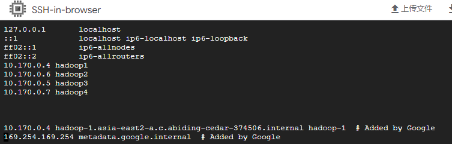

2. Realize SSH password free login.


​			Generate SSH key pairs, and add it to its own `authorized_keys`.

```shell
ssh-keygen -t rsa -P '' -f ~/.ssh/id_rsa
cat ~/.ssh/id_rsa.pub >> ~/.ssh/authorized_keys
chmod 0600 ~/.ssh/authorized_keys
```

​			ssh localhost succuess.

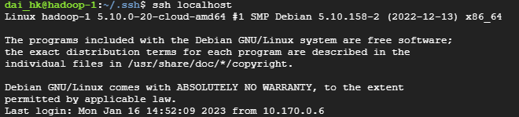

​			Get generated public key.

```shell
cat id_rsa.pub
```

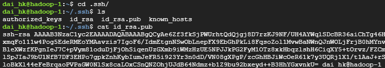

  	Then, put hadoop1's public key into hadoop2's `authorized_keys`.

​		Finally, we can use hadoop2 connect to hadoop1.

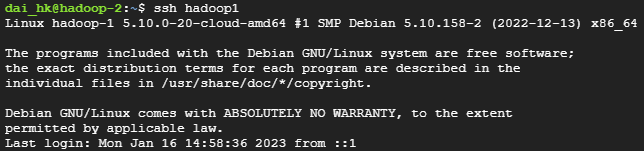

 		*We need ensure every machine could connect each other.*

2. Cluster deployment planning.

|      | Hadoop1               | Hadoop2                         | Hadoop3     | Hadoop4          |
| ---- | :-------------------- | ------------------------------- | ----------- | ---------------- |
| HDFS | **NameNode**/DataNode | DataNode                        | DataNode    | **2NN**/DataNode |
| YARN | NodeManager           | **ResourceManager**/Nodemanager | NodeManager | NodeManager      |

3. Modify configuration files.

`core-site.xml`:

```xml
<?xml version="1.0" encoding="UTF-8"?>
<?xml-stylesheet type="text/xsl" href="configuration.xsl"?>
<configuration>
 	<!-- 指定 NameNode 的地址 -->
 	<property>
 		<name>fs.defaultFS</name>
 		<value>hdfs://35.241.89.168:8020</value>
 	</property>
 	<!-- 指定 hadoop 数据的存储目录 -->
 	<property>
 		<name>hadoop.tmp.dir</name>
 		<value>/opt/module/hadoop-3.1.3/data</value>
 	</property>
 	<!-- 配置 HDFS 网页登录使用的静态用户为 atguigu -->
 	<property>
 		<name>hadoop.http.staticuser.user</name>
 		<value>atguigu</value>
 	</property>
</configuration>
```

`hdfs-site.xml`:

```xml
<?xml version="1.0" encoding="UTF-8"?>
<?xml-stylesheet type="text/xsl" href="configuration.xsl"?>
<configuration>
	<!-- nn web 端访问地址-->
	<property>
 		<name>dfs.namenode.http-address</name>
 		<value>35.241.89.168:9870</value>
 	</property>
	<!-- 2nn web 端访问地址-->
 	<property>
 		<name>dfs.namenode.secondary.http-address</name>
 		<value>35.92.131.195:9868</value>
 	</property>
</configuration>
```

`yarn-site.xml`:

```xml
<?xml version="1.0" encoding="UTF-8"?>
<?xml-stylesheet type="text/xsl" href="configuration.xsl"?>
<configuration>
 	<!-- 指定 MR 走 shuffle -->
 	<property>
 		<name>yarn.nodemanager.aux-services</name>
 		<value>mapreduce_shuffle</value>
 	</property>
 	<!-- 指定 ResourceManager 的地址-->
 	<property>
 		<name>yarn.resourcemanager.hostname</name>
 		<value>35.220.236.25</value>
 	</property>
 	<!-- 环境变量的继承 -->
 	<property>
        <name>yarn.nodemanager.env-whitelist</name>			<value>JAVA_HOME,HADOOP_COMMON_HOME,HADOOP_HDFS_HOME,HADOOP_CONF_DIR,CLASSPATH_PREPEND_DISTCACHE,HADOOP_YARN_HOME,HADOOP_MAPRED_HOME</value>
 	</property>
</configuration>
```

`mapred-site.xml`:

```xml
<?xml version="1.0" encoding="UTF-8"?>
<?xml-stylesheet type="text/xsl" href="configuration.xsl"?>
<configuration>
	<!-- 指定 MapReduce 程序运行在 Yarn 上 -->
 	<property>
 		<name>mapreduce.framework.name</name>
 		<value>yarn</value>
 	</property>
</configuration>

```


### **Wordcount**

1. Create a file folder called `/wcinpt`.

   ```shell 
   mkdir /wcinput
   ```

2. Creat a txt file `word.txt`, input some random strings.

   ```shell
   vim word.txt
   ```

   Enter some strings:

   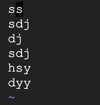

3. Enter Hadoop-2.9.2 file, then open `hadoop-mapreduce-examples-2.9.2`, execute **wordcount** commands, using `/wcinput` as input, and output to `/wcoutput`.

   ```shell
   hadoop jar share/hadoop/mapreduce/hadoop-mapreduce-examples-2.9.2.jar wordcount wcinput/ wcoutput
   ```

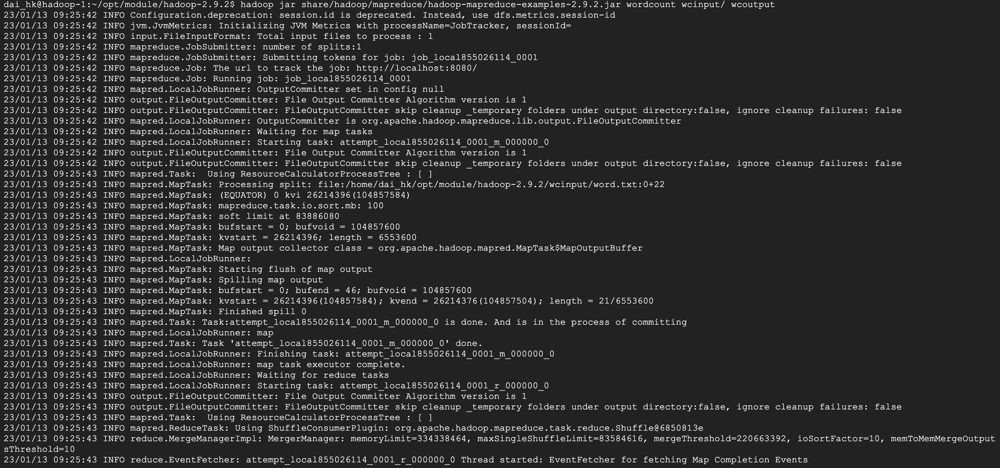

4. Watch the result of **wordcount** program.

   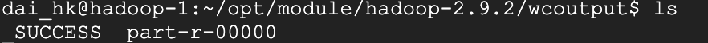

   ```shell
   vim part-r-0000
   ```

   **wordcount** result as following picture show:

​					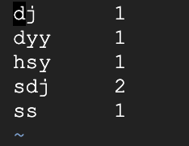

### Reference

1. Setting up a Single Node Cluster. https://hadoop.apache.org/docs/r2.9.2/hadoop-project-dist/hadoop-common/SingleCluster.html

2.  Terasort example.https://hadoop.apache.org/docs/r2.9.2/hadoop-project-dist/hadoop-common/ClusterSetup.html
