# Big-Data-Systems-and-Information-Processing


[TOC]

------


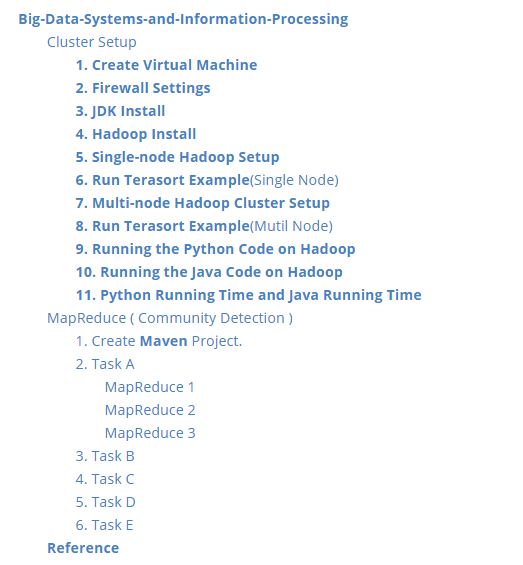

## Cluster Setup


###  **1. Create Virtual Machine**

Hadoop-1 Settings:

1. Ubuntu 18.04 LTS
2. 100GB Hard disk
3. 8G RAM
4. 2 CPU core

###  **2. Firewall Settings**

Create a new rule to the inbound/ ingress. Only allow CUHK IP access VMs.


### **3. JDK Install**

1. Download jdk8 from Oracle, and import it into hadoop-1 virtual machine.


2. Extract it to `/opt/software`.

   ```shell
   tar -zxvf jdk-8u351-linux-x64.tar.gz -C opt/module/
   ```

   Then we get `jdk1.8.0_351` in `/opt/module`

   

   

3. Configure environment variables in `my_env.sh`.

   ```shell
   sudo vim /etc/profile.d/my_env.sh
   ```

   `my_env.sh` :

   ```shell
   #JAVA_HOME
   export JAVA_HOME=/home/dai_hk/opt/module/jdk1.8.0_351
   export PATH=$PATH:$JAVA_HOME/bin
   ```

4. Then, make the new environment variable effective.

   ```shell
   source /etc/profile
   ```

5. Check whether the JDK8 is installed successfully.

   ```shell
   java -version
   ```

   The following figure shows that the JDK installation was successful.

   

### **4. Hadoop Install**

1. Download `hadoop-2.9.2.tar.gz`


2. Extract it to `/opt/software`.

   ```shell
   tar -zxvf hadoop-2.9.2.tar.gz -C opt/module/
   ```

   Then we get `hadoop-2.9.2` in `/opt/module`

   

3. Configure environment variables in `my_env.sh`.

```shell
sudo vim /etc/profile.d/my_env.sh
```

​		`my_env.sh` :

```shell
#HADOOP_HOME
export HADOOP_HOME=/home/dai_hk/opt/module/hadoop-2.9.2
export PATH=$PATH:$HADOOP_HOME/bin
export PATH=$PATH:$HADOOP_HOME/sbin
```

4. Then, make the new environment variable effective.

```shell
source /etc/profile
```

5. Check whether the Hadoop is installed successfully.

```shell
hadoop
```

The following figure shows that the Hadoop installation was successful.


### **5. Single-node Hadoop Setup**

1. Modify ` etc/hadoop/core-site.xml`[1]:


2. Modify `etc/hadoop/hdfs-site.xml`:


3. Format the filesystem:

```shell
dai_hk@hadoop1:~/opt/module/hadoop-2.9.2$ hdfs namenode -format
```

4. Start NameNode daemon and DataNode daemon:

```shell
dai_hk@hadoop1:~/opt/module/hadoop-2.9.2$ start-dfs.sh
```

​			The following problems were found:


​			We need to modify JAVA_HOME path:

```shell
dai_hk@hadoop1:~/opt/module/hadoop-2.9.2/etc/hadoop$ vim hadoop-env.sh
```

​			Use Java path `/home/dai_hk/opt/module/jdk1.8.0_341` to exchange `${JAVA_HOME}`.

​			Then start namenode and datanode again.


​			Finally, use `jps` command to ensure setup successed.

```shell
jps
```

​			Setup result:


5. Visit website http://35.241.122.4:50070/.


​				Single hadoop cluster installation success.

### **6. Run Terasort Example**(Single Node)

1. Generate data for sort.

```shell
dai_hk@hadoop1:~/opt/module/hadoop-2.9.2$ hadoop jar ./share/hadoop/mapreduce/hadoop-mapreduce-examples-2.9.2.jar teragen 100000 terasort/input
```

​			Data generation success.


2. Terasort the generated data

```shell
dai_hk@hadoop1:~/opt/module/hadoop-2.9.2$ hadoop jar ./share/hadoop/mapreduce/hadoop-mapreduce-examples-2.9.2.jar terasort terasort/input terasort/output
```

​			Terasort done.


3. Validate the output is sorted.

```shell
dai_hk@hadoop1:~/opt/module/hadoop-2.9.2$ hadoop jar ./share/hadoop/mapreduce/hadoop-mapreduce-examples-2.9.2.jar teravalidate terasort/output terasort/check
```


###  **7. Multi-node Hadoop Cluster Setup**

1. Configure host name and IP address mapping.

```SHELL
sudo vim /etc/hostname
sudo vim /etc/hosts
```

`/etc/hosts`:


2. Realize SSH password free login.


​			Generate SSH key pairs, and add it to its own `authorized_keys`.

```shell
ssh-keygen -t rsa -P '' -f ~/.ssh/id_rsa
cat ~/.ssh/id_rsa.pub >> ~/.ssh/authorized_keys
chmod 0600 ~/.ssh/authorized_keys
```

​			ssh localhost succuess.


​			Get generated public key.

```shell
cat id_rsa.pub
```


​		Then, put hadoop1's public key into hadoop2's `authorized_keys`.

​		Finally, we can use hadoop2 connect to hadoop1.


​		*We need ensure every machine could connect each other.*

3. Cluster deployment planning.

|      | Hadoop1          | Hadoop2                         | Hadoop3     | Hadoop4     |
| ---- | :--------------- | ------------------------------- | ----------- | ----------- |
| HDFS | **NameNode**/2NN | DataNode                        | DataNode    | DataNode    |
| YARN |                  | **ResourceManager**/Nodemanager | NodeManager | NodeManager |

4. Modify configuration files.

`core-site.xml`:

```xml
<?xml version="1.0" encoding="UTF-8"?>
<?xml-stylesheet type="text/xsl" href="configuration.xsl"?>
<configuration>
 	<!-- 指定 NameNode 的地址 -->
 	<property>
 		<name>fs.defaultFS</name>
 		<value>hdfs://hadoop1:9000</value>
 	</property>
 	<!-- 指定 hadoop 数据的存储目录 -->
 	<property>
 		<name>hadoop.tmp.dir</name>
 		<value>/opt/module/hadoop-2.9.2/data</value>
 	</property>
 	<!-- 配置 HDFS 网页登录使用的静态用户为 dai_hk -->
 	<property>
 		<name>hadoop.http.staticuser.user</name>
 		<value>dai_hk</value>
 	</property>
</configuration>
```

`hdfs-site.xml`:

```xml
<?xml version="1.0" encoding="UTF-8"?>
<?xml-stylesheet type="text/xsl" href="configuration.xsl"?>
<configuration>
    <property>
        <name>dfs.replication</name>
        <value>3</value>
    </property>
    <property>
        <name>dfs.namenode.secondary.http-address</name>
        <value>hadoop1:50090</value>
    </property>
    <property>
        <name>dfs.namenode.secondary.https-address</name>
        <value>hadoop1:50091</value>
    </property>
</configuration>
```

`yarn-site.xml`:

```xml
<?xml version="1.0" encoding="UTF-8"?>
<?xml-stylesheet type="text/xsl" href="configuration.xsl"?>
<configuration>
 	<!-- 指定 MR 走 shuffle -->
 	<property>
 		<name>yarn.nodemanager.aux-services</name>
 		<value>mapreduce_shuffle</value>
 	</property>
 	<!-- 指定 ResourceManager 的地址-->
 	<property>
 		<name>yarn.resourcemanager.hostname</name>
 		<value>hadoop2</value>
 	</property>
</configuration>
```

`mapred-site.xml`:

```xml
<?xml version="1.0" encoding="UTF-8"?>
<?xml-stylesheet type="text/xsl" href="configuration.xsl"?>
<configuration>
	<!-- 指定 MapReduce 程序运行在 Yarn 上 -->
 	<property>
 		<name>mapreduce.framework.name</name>
 		<value>yarn</value>
 	</property>
</configuration>

```

`slaves`:

```xml
hadoop2
hadoop3
hadoop4
```

​	5. Then use command `rsync` copy file to hadoop2, hadoop3, hadoop4.

```shell
rsync -av /home/dai_hk/opt/module/hadoop-2.9.2/etc/hadoop/ dai_hk@hadoop2:/home/dai_hk/opt/module/hadoop-2.9.2/etc/hadoop/
```

6. Format name node.

```shell
hdfs namenode -format
```

7. Start HDFS and YARN.

```shel
start-hdfs.sh
start-yarn.sh
```

8. Enter hdfs system at `hadoop1:50070` in browser

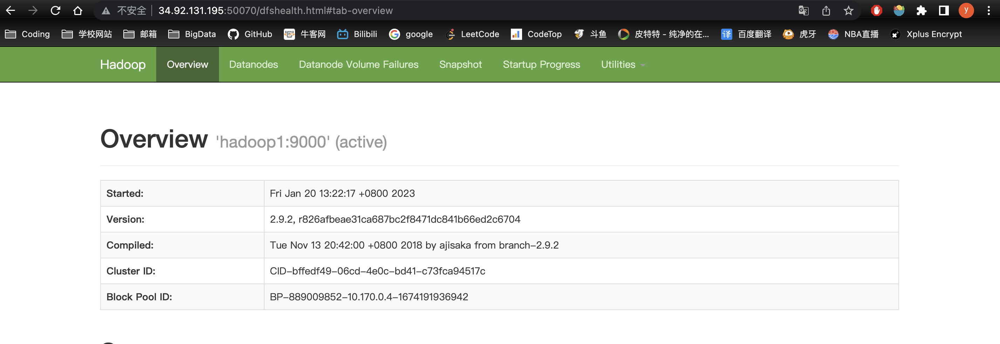

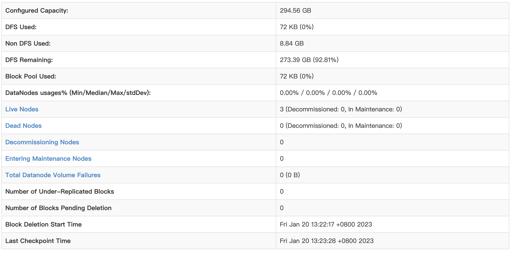

9. Enter yarn system at `hadoop2:8088`.

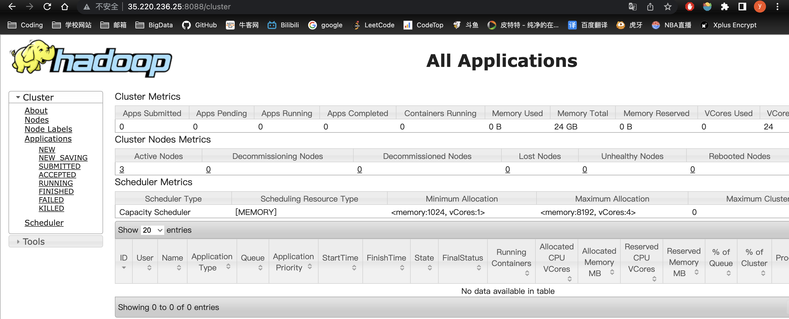

10. Use `jps` to watch nodes situations.


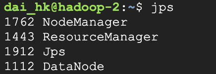


### **8. Run Terasort Example**(Mutil Node)

1. Generate **2GB** data.

```shell
hadoop jar ./share/hadoop/mapreduce/hadoop-mapreduce-examples-2.9.2.jar teragen 21474836 terasort/input
```

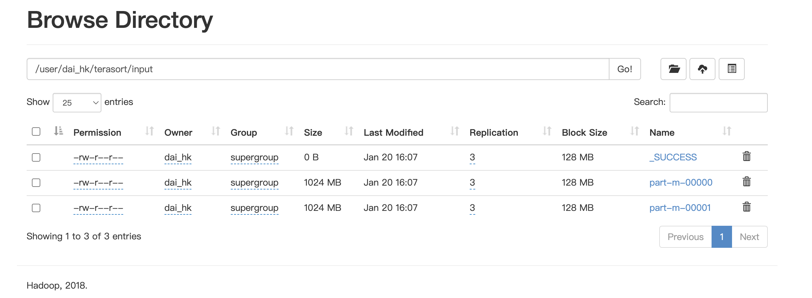

2. Terasort **2GB** data.

```shel
hadoop jar ./share/hadoop/mapreduce/hadoop-mapreduce-examples-2.9.2.jar terasort terasort/input terasort/output
```

​		Running...

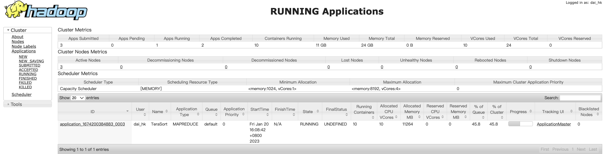

​	Using **1mins,49sec** finish task to sort 2GB data.


3. Generate **20GB** data.

```shell
hadoop jar ./share/hadoop/mapreduce/hadoop-mapreduce-examples-2.9.2.jar teragen 214748360 terasort/input
```

​		Generate...

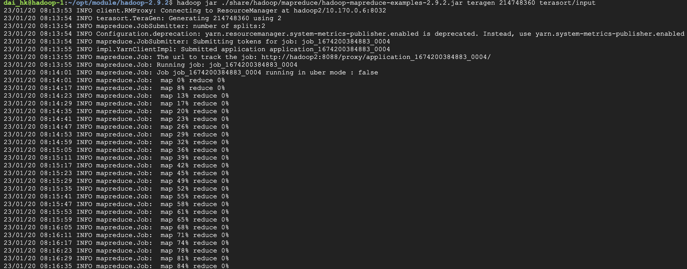

​		Generated.

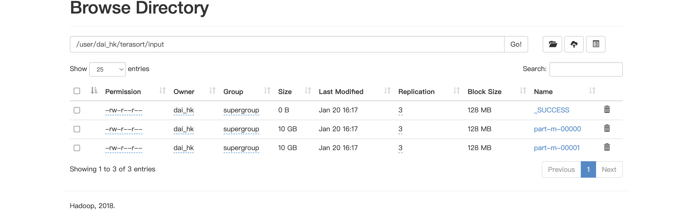

4. Terasort **20GB** data.

```shell
hadoop jar ./share/hadoop/mapreduce/hadoop-mapreduce-examples-2.9.2.jar terasort terasort/input terasort/output
```

​		Running...

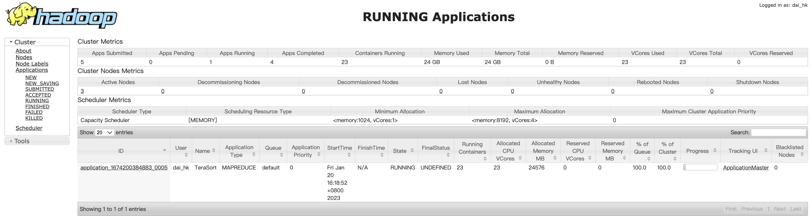

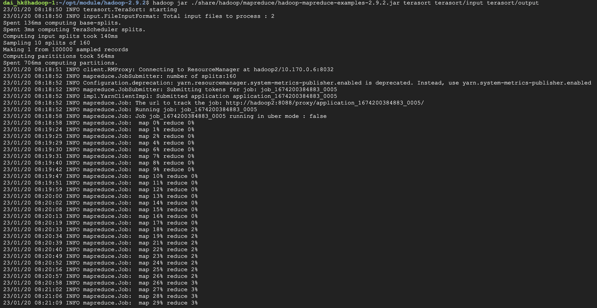

​		Terasort finished. **4hr,24mins,47sec.**

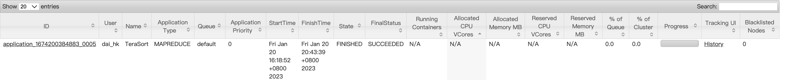


### **9. Running the Python Code on Hadoop**

1. Start python code.

```shell
hadoop jar ./share/hadoop/tools/lib/hadoop-streaming-2.9.2.jar -file mapper.py -mapper mapper.py -file reducer.py -reducer reducer.py -input shakespeare -output output
```

2. Successed ! Use **19sec.**

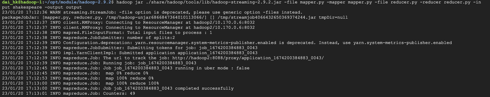


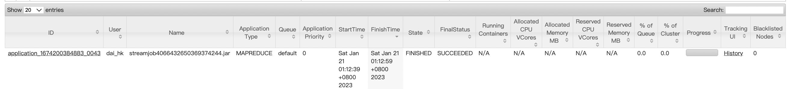

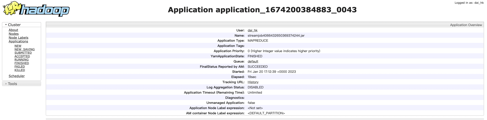

### **10. Running the Java Code on Hadoop**

1. Creat java file, and put wordcount code in it.
2. Add environmental variables.

```shell
export JAVA_HOME=/usr/java/default
export PATH=${JAVA_HOME}/bin:${PATH}
export HADOOP_CLASSPATH=${JAVA_HOME}/lib/tools.jar
```

3. Complile `WordCount.java`. Generate jar file.

```shell
hadoop com.sun.tools.javac.Main WordCount.java
jar cf wc.jar WordCount*.class
```

4. Execute jar file.

```shell
hadoop jar wc.jar WordCount wordcount/input wordcount/output
```

​		Success ! Use **21sec.**

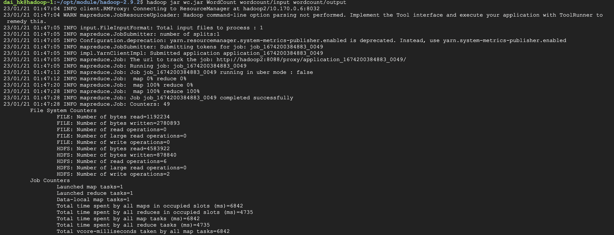


### **11. Python Running Time and Java Running Time**

Python code uses **19sec.**

Java code uses **21sec.**


## **MapReduce ( Community Detection )**

### **1. Create Maven Project.**

​	Using `pom.xml` to manage dependencies:

```xml
<?xml version="1.0" encoding="UTF-8"?>
<project xmlns="http://maven.apache.org/POM/4.0.0" xmlns:xsi="http://www.w3.org/2001/XMLSchema-instance"
	xsi:schemaLocation="http://maven.apache.org/POM/4.0.0 https://maven.apache.org/xsd/maven-4.0.0.xsd">
	<modelVersion>4.0.0</modelVersion>
	<groupId>com.dai</groupId>
	<artifactId>BlogMapReduce</artifactId>
	<version>0.0.1-SNAPSHOT</version>
	<name>BlogMapReduce</name>
	<description>Demo project for Blog MapReducce</description>
	<properties>
		<maven.complier.source>8</maven.complier.source>
		<maven.complier.target>8</maven.complier.target>
	</properties>
	<dependencies>
		<dependency>
			<groupId>org.apache.hadoop</groupId>
			<artifactId>hadoop-client</artifactId>
			<version>2.9.2</version>
		</dependency>
		<dependency>
			<groupId>junit</groupId>
			<artifactId>junit</artifactId>
			<version>4.12</version>
		</dependency>
		<dependency>
			<groupId>org.slf4j</groupId>
			<artifactId>slf4j-log4j12</artifactId>
			<version>1.7.30</version>
		</dependency>
	</dependencies>
	<build>
		<plugins>
			<plugin>
				<artifactId>maven-compiler-plugin</artifactId>
				<version>3.6.1</version>
				<configuration>
				<!--使用java1.8编译-->
					<source>1.8</source>
					<target>1.8</target>
				</configuration>
			</plugin>
		</plugins>
	</build>
</project>

```

### **2. Task A**

> For EVERY blog, recommend the blog with the maximal number of common followees in the medium-sized dataset [2]. If multiple blogs share the same number, pick the one with the largest ID. Your output should consist of m lines, where m is the total number of blogs. Each line follows the format below: 
>
> ​																													**A:B, {C,E}, 2** 
>
> where “A:B” is the blog pair, “{C,E}” is the set of their common followees (no special requirement for the elements’ order, i.e., {E,C} is acceptable), “2” is the count of common followees.


#### MapReduce 1

​		Merge original data, get new K-V. **K is followee, and V contains K's followers.**

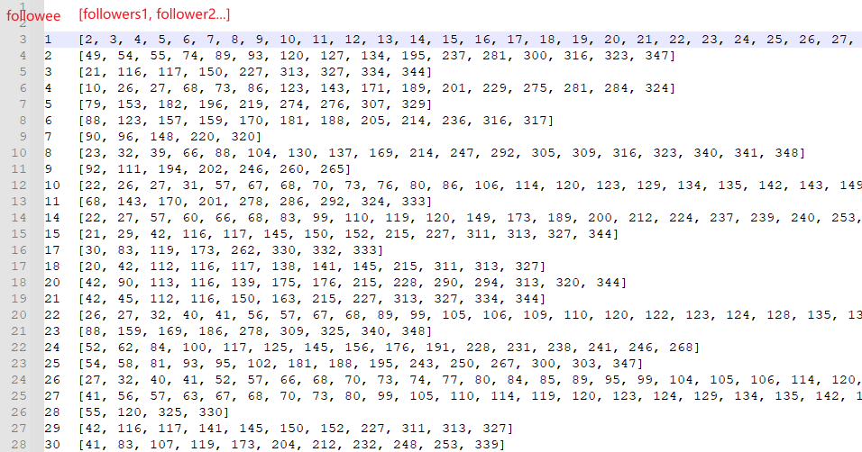

`Mapper`:

```java
package com.dai.mapreduce.communitydetection.mapreduce1;

import org.apache.hadoop.io.LongWritable;
import org.apache.hadoop.io.Text;
import org.apache.hadoop.mapreduce.Mapper;
import java.io.IOException;

public class BlogDetection1Mapper extends Mapper<LongWritable, Text, LongWritable, LongWritable> {
    // 该map输出的key
    private LongWritable outKey = new LongWritable();
    // 该map输出的value
    private LongWritable outValue = new LongWritable();
    @Override
    protected void map(LongWritable key, Text value, Mapper<LongWritable, Text, LongWritable, LongWritable>.Context context) throws IOException, InterruptedException {
        // 获取一行
        String line = value.toString();
        // 用空格将一行中的两个数据进行切割 [A，B] 表示B follow A
        String[] words = line.split(" ");
        // 被关注者作为key
        outKey.set(Long.parseLong(words[0]));
        // 关注者作为value
        outValue.set(Long.parseLong(words[1]));
        // 将数据分割为 K-V 键值对
        context.write(outKey, outValue);
    }
}
```

`Reducer`:

```java
package com.dai.mapreduce.communitydetection.taskA.mapreduce1;

import org.apache.hadoop.io.LongWritable;
import org.apache.hadoop.io.Text;
import org.apache.hadoop.mapreduce.Reducer;
import java.io.IOException;
import java.util.HashSet;
import java.util.Set;

public class BlogDetection1Reducer extends Reducer<LongWritable, LongWritable, LongWritable, Text> {
    private LongWritable outKey = new LongWritable();
    private Text outValue = new Text();
    private Set<Long> set = new HashSet<Long>();

    @Override
    protected void reduce(LongWritable key, Iterable<LongWritable> values, Reducer<LongWritable, LongWritable, LongWritable, Text>.Context context) throws IOException, InterruptedException {
        for (LongWritable value : values) {
            // KEY的关注对象的组合
            set.add(value.get());
        }
        outKey.set(key.get());
        outValue.set(set.toString());
        set.clear();
        // 写出输出数据到上下文
        context.write(outKey, outValue);
    }
}

```

`Driver`:

```java
package com.dai.mapreduce.communitydetection.taskA.mapreduce1;

import org.apache.hadoop.conf.Configuration;
import org.apache.hadoop.fs.Path;
import org.apache.hadoop.io.LongWritable;
import org.apache.hadoop.io.Text;
import org.apache.hadoop.mapreduce.Job;
import org.apache.hadoop.mapreduce.lib.input.FileInputFormat;
import org.apache.hadoop.mapreduce.lib.output.FileOutputFormat;
import java.io.IOException;

public class BlogDetection1Driver {
    public static void main(String[] args) throws IOException, InterruptedException, ClassNotFoundException {
        // 1. 获取job
        Configuration conf = new Configuration();
        Job job = Job.getInstance(conf);

        // 2. 设置jar包路径
        job.setJarByClass(BlogDetection1Driver.class);

        // 3. 关联 mapper 和 reducer
        job.setMapperClass(BlogDetection1Mapper.class);
        job.setReducerClass(BlogDetection1Reducer.class);

        // 4. 设置 mapper 输出的KV类型
        job.setMapOutputKeyClass(LongWritable.class);
        job.setMapOutputValueClass(LongWritable.class);

        // 5. 设置最终输出的KV类型
        job.setOutputKeyClass(Text.class);
        job.setOutputValueClass(Text.class);

        // 6. 设置输入输出路径
        FileInputFormat.setInputPaths(job, new Path(args[0]));
        FileOutputFormat.setOutputPath(job, new Path(args[1]));

        // 7. 提交job
        boolean result = job.waitForCompletion(true);
        System.exit(result ? 0 : 1);
    }
}

```

​		Using Maven package java program, get a .jar file.

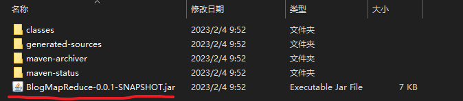		

​		Run MapReduce program in real Hadoop cluster.

```shell
hadoop jar BlogMapReduce-0.0.1-SNAPSHOT.jar com.dai.mapreduce.communitydetection.mapreduce1.BlogDetection1Driver /data/medium/medium_relation /data/output1
```

#### MapReduce 2

​		Using MapReduce 1 output,  Calculate the **Cartesian** product of followers and convert the data into the following form, where K is the combination of two followers, V is their common followers.

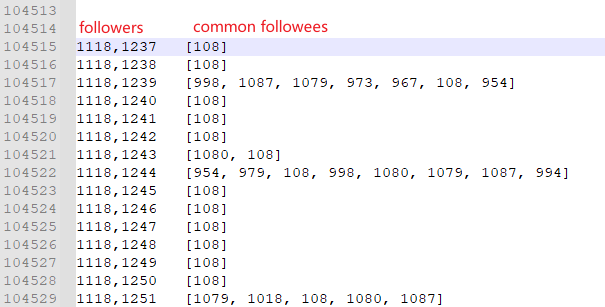

`Mapper`:

```java
package com.dai.mapreduce.communitydetection.taskA.mapreduce2;

import org.apache.hadoop.io.LongWritable;
import org.apache.hadoop.io.Text;
import org.apache.hadoop.mapreduce.Mapper;
import java.io.IOException;

public class BlogDetection2Mapper extends Mapper<LongWritable, Text, Text, Text> {
    // 该map输出的key
    private Text outKey = new Text();
    // 该map输出的value
    private Text outValue = new Text();

    @Override
    protected void map(LongWritable key, Text value, Mapper<LongWritable, Text, Text, Text>.Context context) throws IOException, InterruptedException {
        // 获取一行
        // 2	[49, 54, 55, 74, 89]
        String line = value.toString();
        String[] words = line.split("\t");
        // outValue 由 关注对象组成
        outValue.set(words[0]);
        // 将 [49, 54, 55, 74, 89] 处理到数组中
        String[] followees = words[1].split(", ");
        followees[0] = followees[0].substring(1);
        followees[followees.length - 1] = followees[followees.length - 1].substring(0, followees[followees.length - 1].length() - 1);
        // 求出 [49, 54, 55, 74, 89] 的笛卡尔积
        for (int i = 0; i < followees.length; ++i) {
            for (int j = i + 1; j < followees.length; ++j) {
                outKey.set(followees[i] + "," + followees[j]);
                context.write(outKey, outValue);
            }
        }
    }
}

```

`Reducer`:

```java
package com.dai.mapreduce.communitydetection.taskA.mapreduce2;

import org.apache.hadoop.io.Text;
import org.apache.hadoop.mapreduce.Reducer;
import java.io.IOException;
import java.util.ArrayList;
import java.util.List;

public class BlogDetection2Reducer extends Reducer<Text, Text, Text, Text> {
    private Text outKey = new Text();

    private Text outValue = new Text();

    private List<String> list = new ArrayList<>();

    @Override
    protected void reduce(Text key, Iterable<Text> values, Reducer<Text, Text, Text, Text>.Context context) throws IOException, InterruptedException {
        outKey.set(key);
        for (Text value : values) {
            list.add(value.toString());
        }
        outValue.set(list.toString());
        context.write(outKey, outValue);
        list.clear();
    }
}

```

`Driver`:

```java
package com.dai.mapreduce.communitydetection.taskA.mapreduce2;

import org.apache.hadoop.conf.Configuration;
import org.apache.hadoop.fs.Path;
import org.apache.hadoop.io.Text;
import org.apache.hadoop.mapreduce.Job;
import org.apache.hadoop.mapreduce.lib.input.FileInputFormat;
import org.apache.hadoop.mapreduce.lib.output.FileOutputFormat;

import java.io.IOException;


public class BlogDetection2Driver {
    public static void main(String[] args) throws IOException, InterruptedException, ClassNotFoundException {
        // 1. 获取job
        Configuration conf = new Configuration();
        Job job = Job.getInstance(conf);

        // 2. 设置jar包路径
        job.setJarByClass(BlogDetection2Driver.class);

        // 3. 关联 mapper 和 reducer
        job.setMapperClass(BlogDetection2Mapper.class);
        job.setReducerClass(BlogDetection2Reducer.class);

        // 4. 设置 mapper 输出的KV类型
        job.setMapOutputKeyClass(Text.class);
        job.setMapOutputValueClass(Text.class);

        // 5. 设置最终输出的KV类型
        job.setOutputKeyClass(Text.class);
        job.setOutputValueClass(Text.class);

        // 6. 设置输入输出路径
        FileInputFormat.setInputPaths(job, new Path(args[0]));
        FileOutputFormat.setOutputPath(job, new Path(args[1]));

        // 7. 提交job
        boolean result = job.waitForCompletion(true);
        System.exit(result ? 0 : 1);
    }
}

```

Run MapReduce program in real Hadoop cluster.

```shell
hadoop jar BlogMapReduce1-0.0.1-SNAPSHOT.jar com.dai.mapreduce.communitydetection.mapreduce2.BlogDetection2Driver /data/output1 /data/output2
```

#### MapReduce 3

​		Using MapReduce 3 output, get blog which have most number of common followees with it.

`Mapper`:

```java
package com.dai.mapreduce.communitydetection.taskA.mapreduce3;

import org.apache.hadoop.io.LongWritable;
import org.apache.hadoop.io.Text;
import org.apache.hadoop.mapreduce.Mapper;
import java.io.IOException;

public class BlogDetection3Mapper extends Mapper<LongWritable, Text, LongWritable, Text> {
    // 该map输出的key
    private LongWritable outKey = new LongWritable();
    // 该map输出的value
    private Text outValue = new Text();

    @Override
    protected void map(LongWritable key, Text value, Mapper<LongWritable, Text, LongWritable, Text>.Context context) throws IOException, InterruptedException {
        // 获取一行
        String line = value.toString();
        String[] words = line.split("\t");
        String[] keys = words[0].split(",");
        outKey.set(Long.parseLong(keys[0]));
        outValue.set(keys[1] + "|" + words[1]);
        context.write(outKey, outValue);
        outKey.set(Long.parseLong(keys[1]));
        outValue.set(keys[0] + '|' + words[1]);
        context.write(outKey, outValue);
    }
}

```

`Reducer`:

```java
package com.dai.mapreduce.communitydetection.taskA.mapreduce3;

import org.apache.hadoop.io.LongWritable;
import org.apache.hadoop.io.Text;
import org.apache.hadoop.mapreduce.Reducer;
import java.io.IOException;

public class BlogDetection3Reducer extends Reducer<LongWritable, Text, LongWritable, Text> {
    private LongWritable outKey = new LongWritable();

    private Text outValue = new Text();

    private int maxCommonBlogNums = 0;

    @Override
    protected void reduce(LongWritable key, Iterable<Text> values, Reducer<LongWritable, Text, LongWritable, Text>.Context context) throws IOException, InterruptedException {
        maxCommonBlogNums = 0;
        outKey.set(key.get());
        Long tempFlag = Long.valueOf(0);
        for (Text value : values) {
            String[] words = value.toString().split("\\|");
            String[] commonBlog = words[1].split(", ");
            if (commonBlog.length > maxCommonBlogNums) {
                outValue.set(key + ":" + words[0] + "," + words[1] + "," + commonBlog.length);
                tempFlag = Long.parseLong(words[0]);
            }
            if (commonBlog.length == maxCommonBlogNums) {
                if (Long.parseLong(words[0]) > tempFlag) {
                    outValue.set(key + ":" + words[0] + "," + words[1] + "," + commonBlog.length);
                }
            }
        }
        context.write(outKey, outValue);
    }
}

```

`Driver`:

```java
package com.dai.mapreduce.communitydetection.taskA.mapreduce3;

import org.apache.hadoop.conf.Configuration;
import org.apache.hadoop.fs.Path;
import org.apache.hadoop.io.LongWritable;
import org.apache.hadoop.io.Text;
import org.apache.hadoop.mapreduce.Job;
import org.apache.hadoop.mapreduce.lib.input.FileInputFormat;
import org.apache.hadoop.mapreduce.lib.output.FileOutputFormat;
import java.io.IOException;


public class BlogDetection3Driver {
    public static void main(String[] args) throws IOException, InterruptedException, ClassNotFoundException {
        // 1. 获取job
        Configuration conf = new Configuration();
        Job job = Job.getInstance(conf);

        // 2. 设置jar包路径
        job.setJarByClass(BlogDetection3Driver.class);

        // 3. 关联 mapper 和 reducer
        job.setMapperClass(BlogDetection3Mapper.class);
        job.setReducerClass(BlogDetection3Reducer.class);

        // 4. 设置 mapper 输出的KV类型
        job.setMapOutputKeyClass(LongWritable.class);
        job.setMapOutputValueClass(Text.class);

        // 5. 设置最终输出的KV类型
        job.setOutputKeyClass(LongWritable.class);
        job.setOutputValueClass(Text.class);

        // 6. 设置输入输出路径
        FileInputFormat.setInputPaths(job, new Path(args[0]));
        FileOutputFormat.setOutputPath(job, new Path(args[1]));

        // 7. 提交job
        boolean result = job.waitForCompletion(true);
        System.exit(result ? 0 : 1);
    }
}

```

​		Run MapReduce program in real Hadoop cluster.

```shell
hadoop jar BlogMapReduce2-0.0.1-SNAPSHOT.jar com.dai.mapreduce.communitydetection.mapreduce3.BlogDetection3Driver /data/output2 /data/output3
```

```shell
hadoop fs -cat /data/output3/part-r-00000
```

​		Result: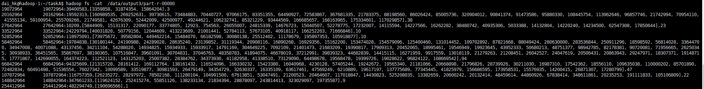


### **3. Task B**

>  Find the TOP K (K=3) most similar blogs of EVERY blog as well as their common followees for the medium-sized dataset [2]. If multiple blogs have the same similarity, randomly pick three of them. For each pair of blogs, output a line with the following format: 
>
> ​																				**A:B, {C,E}, simscore ········································(F1)** 
>
> ( where “simscore” is the similarity score between A and B. )

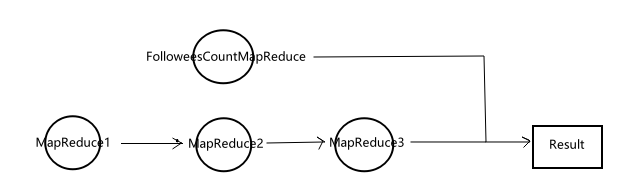


#### FolloweesCountMapReduce

​		Used to count a blog's number of followees. Out format: K - A (a blog)  | V - 10 (number of A's followees).

`Mapper`:

```java
package com.dai.mapreduce.communitydetection.mapreduce;

import org.apache.hadoop.io.IntWritable;
import org.apache.hadoop.io.LongWritable;
import org.apache.hadoop.io.Text;
import org.apache.hadoop.mapreduce.Mapper;
import java.io.IOException;

public class FolloweesCountMapper extends Mapper<LongWritable, Text, LongWritable, IntWritable> {
    // 该map输出的key
    private LongWritable outKey = new LongWritable();
    // 该map输出的value
    private IntWritable outValue = new IntWritable(1);

    @Override
    protected void map(LongWritable key, Text value, Mapper<LongWritable, Text, LongWritable, IntWritable>.Context context) throws IOException, InterruptedException {
        // 获取一行
        String line = value.toString();
        String[] words = line.split(" ");
        outKey.set(Long.parseLong(words[1]));
        context.write(outKey, outValue);
    }
}
```

`Reducer`:

```java
package com.dai.mapreduce.communitydetection.mapreduce1;

import org.apache.hadoop.io.LongWritable;
import org.apache.hadoop.io.Text;
import org.apache.hadoop.mapreduce.Reducer;
import java.io.IOException;
import java.lang.reflect.Array;
import java.util.*;

public class BlogDetection1Reducer extends Reducer<LongWritable, LongWritable, LongWritable, Text> {
    private LongWritable outKey = new LongWritable();
    
    private Text outValue = new Text();

    private List<Long> list = new ArrayList<>();

    @Override
    protected void reduce(LongWritable key, Iterable<LongWritable> values, Reducer<LongWritable, LongWritable, LongWritable, Text>.Context context) throws IOException, InterruptedException {
        for (LongWritable value : values) {
            // KEY的关注对象的组合
            list.add(value.get());
        }
        Collections.sort(list);
        outKey.set(key.get());
        outValue.set(list.toString());
        // 写出输出数据到上下文
        context.write(outKey, outValue);
        list.clear();
    }
}
```

`Driver`:

```java
package com.dai.mapreduce.communitydetection.mapreduce1;

import org.apache.hadoop.conf.Configuration;
import org.apache.hadoop.fs.Path;
import org.apache.hadoop.io.LongWritable;
import org.apache.hadoop.io.Text;
import org.apache.hadoop.mapreduce.Job;
import org.apache.hadoop.mapreduce.lib.input.FileInputFormat;
import org.apache.hadoop.mapreduce.lib.output.FileOutputFormat;
import java.io.IOException;

public class BlogDetection1Driver {
    public static void main(String[] args) throws IOException, InterruptedException, ClassNotFoundException {
        // 1. 获取job
        Configuration conf = new Configuration();
        Job job = Job.getInstance(conf);

        // 2. 设置jar包路径
        job.setJarByClass(BlogDetection1Driver.class);

        // 3. 关联 mapper 和 reducer
        job.setMapperClass(BlogDetection1Mapper.class);
        job.setReducerClass(BlogDetection1Reducer.class);

        // 4. 设置 mapper 输出的KV类型
        job.setMapOutputKeyClass(LongWritable.class);
        job.setMapOutputValueClass(LongWritable.class);

        // 5. 设置最终输出的KV类型
        job.setOutputKeyClass(Text.class);
        job.setOutputValueClass(Text.class);

        // 6. 设置输入输出路径
        FileInputFormat.setInputPaths(job, new Path(args[0]));
        FileOutputFormat.setOutputPath(job, new Path(args[1]));

        // 7. 提交job
        boolean result = job.waitForCompletion(true);
        System.exit(result ? 0 : 1);
    }
}
```

​		Run MapReduce program.

```shell
hadoop jar FolloweesCount-0.0.1-SNAPSHOT.jar com.dai.mapreduce.communitydetection.mapreduce.FolloweesCountDriver /data/medium/medium_relation /data/followees_count
```


#### MapReduce1

​		Key - A (followee) |  Value - B (follower)    -----------------------------> Key - A (followee) | Value - B,C,D (followers)

`Mapper`:

```Java
package com.dai.mapreduce.communitydetection.mapreduce1;

import org.apache.hadoop.io.LongWritable;
import org.apache.hadoop.io.Text;
import org.apache.hadoop.mapreduce.Mapper;
import java.io.IOException;

public class BlogDetection1Mapper extends Mapper<LongWritable, Text, LongWritable, LongWritable> {
    // 该map输出的key
    private LongWritable outKey = new LongWritable();
    // 该map输出的value
    private LongWritable outValue = new LongWritable();
    
    @Override
    protected void map(LongWritable key, Text value, Mapper<LongWritable, Text, LongWritable, LongWritable>.Context context) throws IOException, InterruptedException {
        // 获取一行
        String line = value.toString();
        // 用空格将一行中的两个数据进行切割 [A，B] 表示B follow A
        String[] words = line.split(" ");
        // 被关注者作为key
        outKey.set(Long.parseLong(words[0]));
        // 关注者作为value
        outValue.set(Long.parseLong(words[1]));
        // 将数据分割为 K-V 键值对
        context.write(outKey, outValue);
    }
}

```

`Reducer`:

```java
package com.dai.mapreduce.communitydetection.mapreduce1;

import org.apache.hadoop.io.LongWritable;
import org.apache.hadoop.io.Text;
import org.apache.hadoop.mapreduce.Reducer;
import java.io.IOException;
import java.lang.reflect.Array;
import java.util.*;

public class BlogDetection1Reducer extends Reducer<LongWritable, LongWritable, LongWritable, Text> {
    private LongWritable outKey = new LongWritable();
    
    private Text outValue = new Text();
    
    private List<Long> list = new ArrayList<>();

    @Override
    protected void reduce(LongWritable key, Iterable<LongWritable> values, Reducer<LongWritable, LongWritable, LongWritable, Text>.Context context) throws IOException, InterruptedException {
        for (LongWritable value : values) {
            // KEY的关注对象的组合
            list.add(value.get());
        }
        Collections.sort(list);
        outKey.set(key.get());
        outValue.set(list.toString());
        // 写出输出数据到上下文
        context.write(outKey, outValue);
        list.clear();
    }
}
```

`Driver`:

```java
package com.dai.mapreduce.communitydetection.mapreduce1;

import org.apache.hadoop.conf.Configuration;
import org.apache.hadoop.fs.Path;
import org.apache.hadoop.io.LongWritable;
import org.apache.hadoop.io.Text;
import org.apache.hadoop.mapreduce.Job;
import org.apache.hadoop.mapreduce.lib.input.FileInputFormat;
import org.apache.hadoop.mapreduce.lib.output.FileOutputFormat;
import java.io.IOException;

public class BlogDetection1Driver {
    public static void main(String[] args) throws IOException, InterruptedException, ClassNotFoundException {
        // 1. 获取job
        Configuration conf = new Configuration();
        Job job = Job.getInstance(conf);

        // 2. 设置jar包路径
        job.setJarByClass(BlogDetection1Driver.class);

        // 3. 关联 mapper 和 reducer
        job.setMapperClass(BlogDetection1Mapper.class);
        job.setReducerClass(BlogDetection1Reducer.class);

        // 4. 设置 mapper 输出的KV类型
        job.setMapOutputKeyClass(LongWritable.class);
        job.setMapOutputValueClass(LongWritable.class);

        // 5. 设置最终输出的KV类型
        job.setOutputKeyClass(Text.class);
        job.setOutputValueClass(Text.class);

        // 6. 设置输入输出路径
        FileInputFormat.setInputPaths(job, new Path(args[0]));
        FileOutputFormat.setOutputPath(job, new Path(args[1]));

        // 7. 提交job
        boolean result = job.waitForCompletion(true);
        System.exit(result ? 0 : 1);
    }
}

```

​		Running MapReduce1 program.

```shell
hadoop jar BlogMapReduce-0.0.1-SNAPSHOT.jar com.dai.mapreduce.communitydetection.mapreduce1.BlogDetection1Driver /data/medium/medium_relation /data/output1
```

#### MapReduce2

​		Key - A (followee) | Value - B,C,D (followers) ------------------------------> Key - B | Value - B,C {A} (B,C common follow A)

`Mapper`:

```java
package com.dai.mapreduce.communitydetection.mapreduce2;

import org.apache.hadoop.io.LongWritable;
import org.apache.hadoop.io.Text;
import org.apache.hadoop.mapreduce.Mapper;
import java.io.IOException;

public class BlogDetection2Mapper extends Mapper<LongWritable, Text, Text, Text> {
    // 该map输出的key
    private Text outKey = new Text();
    // 该map输出的value
    private Text outValue = new Text();

    @Override
    protected void map(LongWritable key, Text value, Mapper<LongWritable, Text, Text, Text>.Context context) throws IOException, InterruptedException {
        // 获取一行
        // 2	[49, 54, 55, 74, 89]
        String line = value.toString();
        String[] words = line.split("\t");
        // outValue 由 关注对象组成
        outValue.set(words[0]);
        // 将 [49, 54, 55, 74, 89] 处理到数组中
        String[] followees = words[1].split(", ");
        followees[0] = followees[0].substring(1);
        followees[followees.length - 1] = followees[followees.length - 1].substring(0, followees[followees.length - 1].length() - 1);
        // 求出 [49, 54, 55, 74, 89] 的笛卡尔积
        for (int i = 0; i < followees.length; ++i) {
            for (int j = i + 1; j < followees.length; ++j) {
                outKey.set(followees[i] + "," + followees[j]);
                context.write(outKey, outValue);
            }
        }
    }
}
```

`Reducer`:

```java
package com.dai.mapreduce.communitydetection.mapreduce;

import org.apache.hadoop.io.IntWritable;
import org.apache.hadoop.io.LongWritable;
import org.apache.hadoop.io.Text;
import org.apache.hadoop.mapreduce.Reducer;
import java.io.IOException;

public class FolloweesCountReducer extends Reducer<LongWritable, IntWritable, LongWritable, IntWritable> {
    private LongWritable outKey = new LongWritable();

    private IntWritable outValue = new IntWritable();

    private int sum = 0;

    @Override
    protected void reduce(LongWritable key, Iterable<IntWritable> values, Reducer<LongWritable, IntWritable, LongWritable, IntWritable>.Context context) throws IOException, InterruptedException {
        sum = 0;
        for (IntWritable value : values) {
            sum += 1;
        }
        outKey.set(key.get());
        outValue.set(sum);
        context.write(outKey, outValue);
    }
}
```

`Driver`:

```java
package com.dai.mapreduce.communitydetection.mapreduce1;

import org.apache.hadoop.conf.Configuration;
import org.apache.hadoop.fs.Path;
import org.apache.hadoop.io.LongWritable;
import org.apache.hadoop.io.Text;
import org.apache.hadoop.mapreduce.Job;
import org.apache.hadoop.mapreduce.lib.input.FileInputFormat;
import org.apache.hadoop.mapreduce.lib.output.FileOutputFormat;
import java.io.IOException;

public class BlogDetection1Driver {
    public static void main(String[] args) throws IOException, InterruptedException, ClassNotFoundException {
        // 1. 获取job
        Configuration conf = new Configuration();
        Job job = Job.getInstance(conf);

        // 2. 设置jar包路径
        job.setJarByClass(BlogDetection1Driver.class);

        // 3. 关联 mapper 和 reducer
        job.setMapperClass(BlogDetection1Mapper.class);
        job.setReducerClass(BlogDetection1Reducer.class);

        // 4. 设置 mapper 输出的KV类型
        job.setMapOutputKeyClass(LongWritable.class);
        job.setMapOutputValueClass(LongWritable.class);

        // 5. 设置最终输出的KV类型
        job.setOutputKeyClass(Text.class);
        job.setOutputValueClass(Text.class);

        // 6. 设置输入输出路径
        FileInputFormat.setInputPaths(job, new Path(args[0]));
        FileOutputFormat.setOutputPath(job, new Path(args[1]));

        // 7. 提交job
        boolean result = job.waitForCompletion(true);
        System.exit(result ? 0 : 1);
    }
}
```

​		Running MapReduce2 program.

```shell
hadoop jar BlogMapReduce1-0.0.1-SNAPSHOT.jar com.dai.mapreduce.communitydetection.mapreduce2.BlogDetection2Driver /data/output1 /data/output2
```


#### MapReduce3

`Mapper`:

```java
package com.dai.mapreduce.communitydetection.mapreduce3;

import org.apache.commons.lang.StringUtils;
import org.apache.hadoop.fs.FSDataInputStream;
import org.apache.hadoop.fs.FileSystem;
import org.apache.hadoop.fs.Path;
import org.apache.hadoop.io.IOUtils;
import org.apache.hadoop.io.LongWritable;
import org.apache.hadoop.io.Text;
import org.apache.hadoop.mapreduce.Mapper;
import java.io.BufferedReader;
import java.io.IOException;
import java.io.InputStreamReader;
import java.net.URI;
import java.util.HashMap;
import java.util.Map;


public class BlogDetection3Mapper extends Mapper<LongWritable, Text, Text, Text> {
    // 该map输出的key
    private Text outKey = new Text();
    // 该map输出的value
    private Text outValue = new Text();

    private Map<Long, Integer> followeesCountMap = new HashMap<>();

    // mapper前初始化加载缓存文件
    @Override
    protected void setup(Mapper<LongWritable, Text, Text, Text>.Context context) throws IOException, InterruptedException {
        //通过缓存文件得到小表数据 output0
        URI[] cacheFiles = context.getCacheFiles();
        Path path = new Path(cacheFiles[0]);

        //获取文件系统对象,并开流
        FileSystem fs = FileSystem.get(context.getConfiguration());
        FSDataInputStream fis = fs.open(path);

        //通过包装流转换为 reader,方便按行读取
        BufferedReader reader = new BufferedReader(new InputStreamReader(fis, "UTF-8"));
        //逐行读取，按行处理
        String line;
        while (StringUtils.isNotEmpty(line = reader.readLine())) {
            //切割一行
            //A : A 的关注数
            String[] split = line.split("\t");
            followeesCountMap.put(Long.parseLong(split[0]), Integer.parseInt(split[1]));
        }
        //关流
        IOUtils.closeStream(reader);
    }

    @Override
    protected void map(LongWritable key, Text value, Mapper<LongWritable, Text, Text, Text>.Context context) throws IOException, InterruptedException {
        // 获取一行
        String line = value.toString();
        String[] words = line.split("\t");
        String[] keys = words[0].split(",");
        outKey.set(keys[0] + "-" + followeesCountMap.get(Long.parseLong(keys[0])));
        outValue.set(keys[1] + "-" + followeesCountMap.get(Long.parseLong(keys[1])) + "|" + words[1]);
        context.write(outKey, outValue);
        outKey.set(keys[1] + "-"  + followeesCountMap.get(Long.parseLong(keys[1])));
        outValue.set(keys[0] + "-" + followeesCountMap.get(Long.parseLong(keys[0])) + '|' + words[1]);
        context.write(outKey, outValue);
    }
}
```

`Reducer`:

```java
package com.dai.mapreduce.communitydetection.mapreduce3;

import org.apache.hadoop.io.LongWritable;
import org.apache.hadoop.io.Text;
import org.apache.hadoop.mapreduce.Reducer;
import java.io.IOException;
import java.util.Comparator;
import java.util.PriorityQueue;

/**

 */
public class BlogDetection3Reducer extends Reducer<Text, Text, LongWritable, Text> {
    private LongWritable outKey = new LongWritable();

    private Text outValue = new Text();

    // 用优先队列构造容量为3的最小堆
    private PriorityQueue<ValueAndSimilarity> minheap = new PriorityQueue<>(3, new Comparator<ValueAndSimilarity>() {
        // 重写comparator
        @Override
        public int compare(ValueAndSimilarity o1, ValueAndSimilarity o2) {
            return o1.getSimilarity() - o2.getSimilarity() > 0 ?  1 : -1;
        }
    });

    class ValueAndSimilarity {
        Text value;
        Double similarity;

        public void set(Text value, Double similarity) {
            this.value = value;
            this.similarity = similarity;
        }

        public Text getValue() {
            return this.value;
        }

        public Double getSimilarity() {
            return similarity;
        }

        // 无参构造方法
        public ValueAndSimilarity() {
        }

        //有参构造方法
        public ValueAndSimilarity(Text value, Double similarity) {
            this.value = value;
            this.similarity = similarity;
        }
    }

    @Override
    protected void reduce(Text key, Iterable<Text> values, Reducer<Text, Text, LongWritable, Text>.Context context) throws IOException, InterruptedException {
//        String blogIndex = String.valueOf(key);
//        if (blogIndex.substring(blogIndex.length() - 4) != "2964") return;
        // A-4 分割为 [A , 4]
        String[] tempInfo = key.toString().split("-");
        outKey.set(Long.parseLong(tempInfo[0]));
        if (!key.toString().endsWith("2964")) return;
        // 记录key关注者的个数
        int followeesNum = Integer.parseInt(tempInfo[1]);
        int otherFolloweesNum = 0;
        double similarity = 0;
        ValueAndSimilarity valueAndSimilarity = new ValueAndSimilarity();
        for (Text value : values) {
            // D-5|[B,C,E] 分割为 [ D-5, [B,C,E] ]
            String[] temp = value.toString().split("\\|");
            String[] commonFollowees = temp[1].split(", ");
            // D-5 分割为 [D, 5]
            String[] temp2= temp[0].split("-");
            String tempStr = temp2[0] + "," + temp[1];
            otherFolloweesNum = Integer.parseInt(temp2[1]);
            // 计算相似度的公式
            similarity = (double)commonFollowees.length / ((double)followeesNum + (double)otherFolloweesNum - (double)commonFollowees.length);
            if (minheap.size() < 3) {
                minheap.add(new ValueAndSimilarity(new Text(tempStr), similarity));
            } else {
                if (similarity > minheap.peek().similarity) {
                    minheap.add(new ValueAndSimilarity(new Text(tempStr), similarity));
                    minheap.poll();
                }
            }
        }
        for (ValueAndSimilarity elem : minheap) {
            outValue.set(tempInfo[0] + ":" + elem.getValue().toString() + "," + elem.getSimilarity());
            context.write(outKey, outValue);
        }
        minheap.clear();
    }
}
```

`Driver`:

```java
package com.dai.mapreduce.communitydetection.mapreduce3;

import org.apache.hadoop.conf.Configuration;
import org.apache.hadoop.fs.Path;
import org.apache.hadoop.io.LongWritable;
import org.apache.hadoop.io.Text;
import org.apache.hadoop.mapreduce.Job;
import org.apache.hadoop.mapreduce.lib.input.FileInputFormat;
import org.apache.hadoop.mapreduce.lib.output.FileOutputFormat;
import java.io.IOException;
import java.net.URI;
import java.net.URISyntaxException;


public class BlogDetection3Driver {
    public static void main(String[] args) throws IOException, InterruptedException, ClassNotFoundException, URISyntaxException {
        // 1. 获取job
        Configuration conf = new Configuration();
        Job job = Job.getInstance(conf);

        // 2. 设置jar包路径
        job.setJarByClass(BlogDetection3Driver.class);

        // 3. 关联 mapper 和 reducer
        job.setMapperClass(BlogDetection3Mapper.class);
        job.setReducerClass(BlogDetection3Reducer.class);

        // 4. 设置 mapper 输出的KV类型
        job.setMapOutputKeyClass(Text.class);
        job.setMapOutputValueClass(Text.class);

        // 5. 设置最终输出的KV类型
        job.setOutputKeyClass(Text.class);
        job.setOutputValueClass(Text.class);

        // 读取文件进入缓存
//        job.addCacheFile(new URI("file:///C://Users//Administrator//Desktop//Big-Data-Systems-and-Information-Processing//2.CommuityDetection//output0//part-r-00000"));
        job.addCacheFile(new URI(args[2]));

        // 6. 设置输入输出路径
//        FileInputFormat.setInputPaths(job, new Path("C:\\Users\\Administrator\\Desktop\\Big-Data-Systems-and-Information-Processing\\2.CommuityDetection\\output2\\part-r-00000"));
//        FileOutputFormat.setOutputPath(job, new Path("C:\\Users\\Administrator\\Desktop\\Big-Data-Systems-and-Information-Processing\\2.CommuityDetection\\output3"));
        FileInputFormat.setInputPaths(job, new Path(args[0]));
        FileOutputFormat.setOutputPath(job, new Path(args[1]));

        // 7. 提交job
        boolean result = job.waitForCompletion(true);
        System.exit(result ? 0 : 1);
    }
}
```

​		Run MapReduce3 program.

```shell
hadoop jar BlogMapReduce2-0.0.1-SNAPSHOT.jar com.dai.mapreduce.communitydetection.mapreduce3.BlogDetection3Driver /data/output2 /data/output3 /data/followees_count 
```

```shell
hadoop fs -cat /data/output3/part-r-00000
```

​		Result:

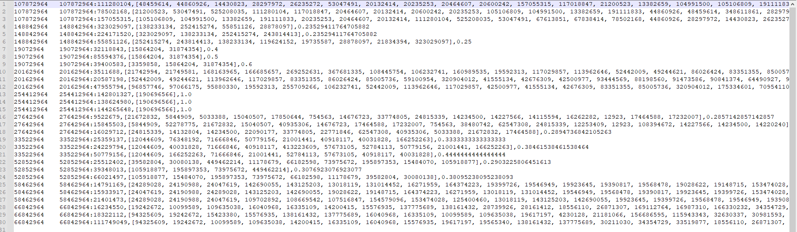


### **4. Task C**

> In fact, each blog is annotated with a label indicating its community. In each dataset, a label file is provided, with the first column indicating the blog ID and the second column indicating the label value. For example, the small dataset has seven different labels (the value ranges from 0 to 6), which means that each blog is from one of the seven communities. For each community in the medium dataset, please figure out how many (unique) members act as the common followees of other blogs. (For example, suppose that A, B, C, D, E are labeled with community 0, 1, 2, 1, 2, respectively. Then, for community 0, one of its members (blog A) acts as the common followee of others (blog B and D). As for community 1, none of its members is the common followee of others.) Your reported results should be formatted like the following example:  
>
> ​																													**Community 0: 1** 
>
> ​																													**Community 1: 0** 
>
> ​																													**Community 2: 2**

#### MapReduce1

`Mapper`:

```java
package com.dai.mapreduce.communitydetection.mapreduce1;

import org.apache.hadoop.io.LongWritable;
import org.apache.hadoop.io.Text;
import org.apache.hadoop.mapreduce.Mapper;
import java.io.IOException;

/**
 * Task a: 寻找两篇博客的共同关注
 * Input: _relation
 * KEYIN: map阶段的输入的key的类型，默认为每次读取的偏移量 LongWritable
 * VALUEIN: map阶段输入的value Text: 默认为读取一整行的内容
 * KEYOUT: map阶段输出的key
 * VALUEOUT: may阶段输出的value
 */
public class BlogDetection1Mapper extends Mapper<LongWritable, Text, LongWritable, LongWritable> {
    // 该map输出的key
    private LongWritable outKey = new LongWritable();
    // 该map输出的value
    private LongWritable outValue = new LongWritable();
    /**
     * map 阶段, map每行都会被调用一次
     * @param key 输入时的key
     * @param value 输入时的value
     * @param context
     * @throws IOException
     * @throws InterruptedException
     */
    @Override
    protected void map(LongWritable key, Text value, Mapper<LongWritable, Text, LongWritable, LongWritable>.Context context) throws IOException, InterruptedException {
        // 获取一行
        String line = value.toString();
        // 用空格将一行中的两个数据进行切割 [A，B] 表示B follow A
        String[] words = line.split(" ");
        // 被关注者作为key
        outKey.set(Long.parseLong(words[0]));
        // 关注者作为value
        outValue.set(Long.parseLong(words[1]));
        // 将数据分割为 K-V 键值对
        context.write(outKey, outValue);
    }
}
```

`Reducer`:

```java
package com.dai.mapreduce.communitydetection.mapreduce1;

import org.apache.hadoop.io.IntWritable;
import org.apache.hadoop.io.LongWritable;
import org.apache.hadoop.mapreduce.Reducer;
import java.io.IOException;
import java.util.*;

public class BlogDetection1Reducer extends Reducer<LongWritable, LongWritable, LongWritable, IntWritable> {
    private LongWritable outKey = new LongWritable();
    private IntWritable outValue = new IntWritable();

    private List<Long> list = new ArrayList<>();

    /**
     * 重写reduce方法，每个key都会运行一次reduce方法
     * @param key 输入的key
     * @param values 按key合并后的value的组合
     * @param context
     * @throws IOException
     * @throws InterruptedException
     */
    @Override
    protected void reduce(LongWritable key, Iterable<LongWritable> values, Reducer<LongWritable, LongWritable, LongWritable, IntWritable>.Context context) throws IOException, InterruptedException {
        for (LongWritable value : values) {
            // KEY的关注对象的组合
            list.add(value.get());
        }
        outKey.set(key.get());
        // 1 代表是共同关注者， 0 则不是共同关注者
        if (list.size() > 1) {
            outValue.set(1);
        } else {
            outValue.set(0);
        }
        // 写出输出数据到上下文
        context.write(outKey, outValue);
        list.clear();
    }
}
```

`Driver`:

```java
package com.dai.mapreduce.communitydetection.mapreduce1;

import org.apache.hadoop.conf.Configuration;
import org.apache.hadoop.fs.Path;
import org.apache.hadoop.io.IntWritable;
import org.apache.hadoop.io.LongWritable;
import org.apache.hadoop.io.Text;
import org.apache.hadoop.mapreduce.Job;
import org.apache.hadoop.mapreduce.lib.input.FileInputFormat;
import org.apache.hadoop.mapreduce.lib.output.FileOutputFormat;

import java.io.IOException;

public class BlogDetection1Driver {
    public static void main(String[] args) throws IOException, InterruptedException, ClassNotFoundException {
        // 1. 获取job
        Configuration conf = new Configuration();
        Job job = Job.getInstance(conf);

        // 2. 设置jar包路径
        job.setJarByClass(BlogDetection1Driver.class);

        // 3. 关联 mapper 和 reducer
        job.setMapperClass(BlogDetection1Mapper.class);
        job.setReducerClass(BlogDetection1Reducer.class);

        // 4. 设置 mapper 输出的KV类型
        job.setMapOutputKeyClass(LongWritable.class);
        job.setMapOutputValueClass(LongWritable.class);

        // 5. 设置最终输出的KV类型
        job.setOutputKeyClass(LongWritable.class);
        job.setOutputValueClass(IntWritable.class);

        // 6. 设置输入输出路径
        FileInputFormat.setInputPaths(job, new Path("C:\\Users\\Administrator\\Desktop\\Big-Data-Systems-and-Information-Processing\\2.CommuityDetection\\input\\medium\\medium_relation"));
        FileOutputFormat.setOutputPath(job, new Path("C:\\Users\\Administrator\\Desktop\\Big-Data-Systems-and-Information-Processing\\2.CommuityDetection\\output0"));
//        FileInputFormat.setInputPaths(job, new Path(args[0]));
//        FileOutputFormat.setOutputPath(job, new Path(args[1]));

        // 7. 提交job
        boolean result = job.waitForCompletion(true);
        System.exit(result ? 0 : 1);
    }
}
```

#### MapReduce2

`Mapper`:

```java
package com.dai.mapreduce.communitydetection.mapreduce2;

import org.apache.commons.lang.StringUtils;
import org.apache.hadoop.fs.FSDataInputStream;
import org.apache.hadoop.fs.FileSystem;
import org.apache.hadoop.fs.Path;
import org.apache.hadoop.io.IOUtils;
import org.apache.hadoop.io.IntWritable;
import org.apache.hadoop.io.LongWritable;
import org.apache.hadoop.io.Text;
import org.apache.hadoop.mapreduce.Mapper;

import java.io.BufferedReader;
import java.io.IOException;
import java.io.InputStreamReader;
import java.net.URI;
import java.util.HashMap;
import java.util.Map;

public class BlogDetection2Mapper extends Mapper<LongWritable, Text, IntWritable, IntWritable> {
    // 该map输出的key
    private IntWritable outKey = new IntWritable();
    // 该map输出的value
    private IntWritable outValue = new IntWritable();

    private Map<Long, Integer> isCommonFollowee = new HashMap<>();

    @Override
    protected void setup(Mapper<LongWritable, Text, IntWritable, IntWritable>.Context context) throws IOException, InterruptedException {
        //通过缓存文件得到小表数据 output0
        URI[] cacheFiles = context.getCacheFiles();
        Path path = new Path(cacheFiles[0]);

        //获取文件系统对象,并开流
        FileSystem fs = FileSystem.get(context.getConfiguration());
        FSDataInputStream fis = fs.open(path);

        //通过包装流转换为 reader,方便按行读取
        BufferedReader reader = new BufferedReader(new InputStreamReader(fis, "UTF-8"));
        //逐行读取，按行处理
        String line;
        while (StringUtils.isNotEmpty(line = reader.readLine())) {
            //切割一行
            //A : A是否是common followee
            String[] split = line.split("\t");
            isCommonFollowee.put(Long.parseLong(split[0]), Integer.parseInt(split[1]));
        }
        //关流
        IOUtils.closeStream(reader);
    }

    @Override
    protected void map(LongWritable key, Text value, Mapper<LongWritable, Text, IntWritable, IntWritable>.Context context) throws IOException, InterruptedException {
        String line = value.toString();
        String[] words = line.split(" ");
        String blog = words[0];
        String label = words[1];
        outKey.set(Integer.parseInt(label));
        if (isCommonFollowee.get(Long.parseLong(blog)) != null) {
            outValue.set(isCommonFollowee.get(Long.parseLong(blog)));
        } else {
            outValue.set(0);
        }
        context.write(outKey, outValue);
    }
}
```

`Reducer`:

```java
package com.dai.mapreduce.communitydetection.mapreduce2;

import org.apache.hadoop.io.IntWritable;
import org.apache.hadoop.io.LongWritable;
import org.apache.hadoop.io.Text;
import org.apache.hadoop.mapreduce.Reducer;
import java.io.IOException;
import java.util.ArrayList;
import java.util.List;

/**

 */
public class BlogDetection2Reducer extends Reducer<IntWritable, IntWritable, Text, LongWritable> {

    private Text outKey = new Text();

    private LongWritable outValue = new LongWritable();

    @Override
    protected void reduce(IntWritable key, Iterable<IntWritable> values, Reducer<IntWritable, IntWritable, Text, LongWritable>.Context context) throws IOException, InterruptedException {
        int sum = 0;
        for (IntWritable value : values) {
            sum += value.get();
        }
        outKey.set("Community " + key);
        outValue.set(sum);
        context.write(outKey, outValue);
    }
}
```

`Driver`:

```java
package com.dai.mapreduce.communitydetection.mapreduce2;

import org.apache.hadoop.conf.Configuration;
import org.apache.hadoop.fs.Path;
import org.apache.hadoop.io.IntWritable;
import org.apache.hadoop.io.LongWritable;
import org.apache.hadoop.io.Text;
import org.apache.hadoop.mapreduce.Job;
import org.apache.hadoop.mapreduce.lib.input.FileInputFormat;
import org.apache.hadoop.mapreduce.lib.output.FileOutputFormat;

import java.io.IOException;
import java.net.URI;
import java.net.URISyntaxException;


public class BlogDetection2Driver {
    public static void main(String[] args) throws IOException, InterruptedException, ClassNotFoundException, URISyntaxException {
        // 1. 获取job
        Configuration conf = new Configuration();
        Job job = Job.getInstance(conf);

        // 2. 设置jar包路径
        job.setJarByClass(BlogDetection2Driver.class);

        // 3. 关联 mapper 和 reducer
        job.setMapperClass(BlogDetection2Mapper.class);
        job.setReducerClass(BlogDetection2Reducer.class);

        // 4. 设置 mapper 输出的KV类型
        job.setMapOutputKeyClass(IntWritable.class);
        job.setMapOutputValueClass(IntWritable.class);

        // 5. 设置最终输出的KV类型
        job.setOutputKeyClass(Text.class);
        job.setOutputValueClass(LongWritable.class);

        // 读取文件进入缓存
        job.addCacheFile(new URI("file:///C://Users//Administrator//Desktop//Big-Data-Systems-and-Information-Processing//2.CommuityDetection//output0//part-r-00000"));

        // 6. 设置输入输出路径
        FileInputFormat.setInputPaths(job, new Path("C:\\Users\\Administrator\\Desktop\\Big-Data-Systems-and-Information-Processing\\2.CommuityDetection\\input\\medium\\medium_label"));
        FileOutputFormat.setOutputPath(job, new Path("C:\\Users\\Administrator\\Desktop\\Big-Data-Systems-and-Information-Processing\\2.CommuityDetection\\output1"));
//        FileInputFormat.setInputPaths(job, new Path(args[0]));
//        FileOutputFormat.setOutputPath(job, new Path(args[1]));

        // 7. 提交job
        boolean result = job.waitForCompletion(true);
        System.exit(result ? 0 : 1);
    }
}

```

Result:

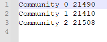

### **5. Task D**

> Run part (a) for the medium dataset multiple times while modifying the number of mappers and reducers for your MapReduce job(s) each time. You need to examine and report the performance of your program for at least 4 different runs. Each run should use a different combination of the number of mappers and reducers. For each run, performance statistics to be reported should include: 
>
> (i) the time consumed by the entire MapReduce job(s);
>
> (ii) the maximum, minimum and average time consumed by mapper and reducer tasks; 
>
> (iii) tabulate the time consumption for each MapReduce job and its tasks. 


#### Comparison of different settings

| #Job | #MapReduce  | Mapper num | Reducer  num | Max mapper time | Min mapper time | Avg mapper time | Max reducer time | Min reducer time | Avg reducer time | Total time  |
| :--: | :---------: | :--------: | :----------: | :-------------: | :-------------: | :-------------: | :--------------: | :--------------: | :--------------: | :---------: |
|  1   | MapReduce-1 |     1      |      1       |      7sec       |      7sec       |      7sec       |       1sec       |       1sec       |       1sec       |    16sec    |
|  1   | MapReduce-2 |     1      |      1       |      3mins      |      3mins      |      3mins      |      49sec       |      49sec       |      49sec       | 4mins,5sec  |
|  1   | MapReduce-3 |     9      |      1       |   1mins,16sec   |      14sec      |      49sec      |      57sec       |      57sec       |      57sec       | 2mins,19sec |
|      |             |            |              |                 |                 |                 |                  |                  |                  |             |
|  2   | MapReduce-1 |     1      |      2       |      6sec       |      6sec       |      6sec       |       1sec       |       1sec       |       1sec       |    16sec    |
|  2   | MapReduce-2 |     2      |      2       |   2mins,33sec   |   2mins,33sec   |   2mins,33sec   |      28sec       |      28sec       |      28sec       | 3mins,11sec |
|  2   | MapReduce-3 |     18     |      2       |   1mins,15sec   |      9sec       |      1mins      |      50sec       |      50sec       |      50sec       | 2mins,29sec |
|      |             |            |              |                 |                 |                 |                  |                  |                  |             |
|  3   | MapReduce-1 |     1      |      4       |      6sec       |      6sec       |      6sec       |       2sec       |       0sec       |       1sec       |    17sec    |
|  3   | MapReduce-2 |     4      |      4       |   2mins,35sec   |   2mins,25sec   |   2mins,32sec   |      27sec       |      15sec       |      22sec       | 3mins,6sec  |
|  3   | MapReduce-3 |     20     |      4       |   1mins,12sec   |      21sec      |      52sec      |      55sec       |      51sec       |      53sec       | 2mins,23sec |
|      |             |            |              |                 |                 |                 |                  |                  |                  |             |
|  4   | MapReduce-1 |     1      |      4       |      5sec       |      5sec       |      5sec       |       1sec       |       0sec       |       1sec       |    17sec    |
|  4   | MapReduce-2 |     4      |      4       |   2mins,33sec   |   2mins,20sec   |   2mins,29sec   |      26sec       |      15sec       |      21sec       | 3mins,3sec  |
|  4   | MapReduce-3 |     12     |      4       |   1mins,59sec   |      14sec      |      59sec      |      26sec       |      25sec       |      26sec       | 2mins,33sec |

##### Job 1

​		Split size is default 128MB.

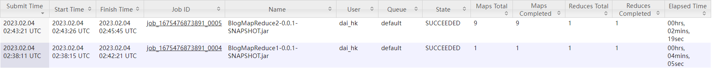


##### Job 2

​		Set split max size to 64MB, and set reduce task number to 2.

```java
conf.set(FileInputFormat.SPLIT_MAXSIZE,"67108864"); // 切片大小设置为64MB
job.setNumReduceTasks(2);
```

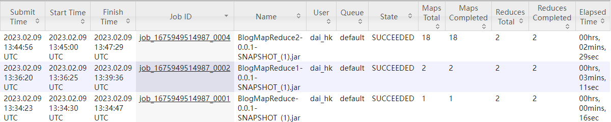

##### Job 3

​		Set reduce task number to 4.

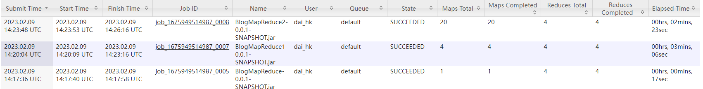

##### Job 4

​		Set split max size to 256MB.

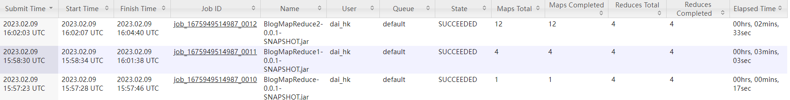


### **6. Task E**

> Find the TOP K (K=3) most similar blogs and the list of common followees for each blog in the large dataset in [3] using the format of Q1(b). 

Based Task B add mapper output compression.

```java
		// 开启map输出
        conf.setBoolean("mapreduce.map.output.compress", true);
        // 一旦map端开启输出，我们就要指定map压缩采用什么压缩机制
        conf.setClass("mapreduce.map.output.compress.codec", DefaultCodec.class, CompressionCodec.class);
```

After 10hrs running, because of lack of disk memory, the task was killed.

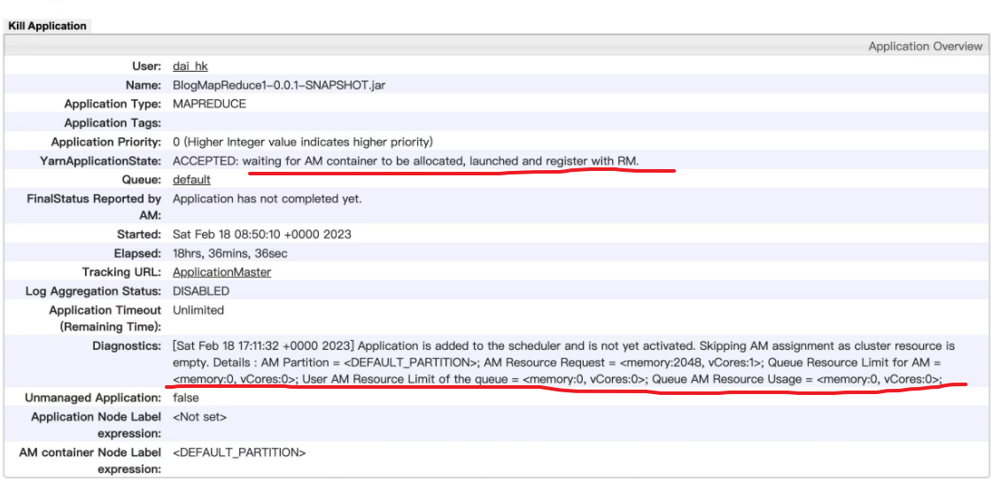

## **Reference**

1. Setting up a Single Node Cluster. https://hadoop.apache.org/docs/r2.9.2/hadoop-project-dist/hadoop-common/SingleCluster.html
2.  Terasort example.https://hadoop.apache.org/docs/r2.9.2/hadoop-project-dist/hadoop-common/ClusterSetup.html
2.  Python wordcount:https://www.michael-noll.com/tutorials/writing-an-hadoop-mapreduce-program-in-python/
2.  Java wordcount:https://hadoop.apache.org/docs/stable/hadoop-mapreduce-client/hadoop-mapreduce-client-core/MapReduceTutorial.html#Example:_WordCount_v1.0
2.  Community Detection MapReduce:https://blog.csdn.net/qq_45347768/article/details/127498788
2.  Set map tasks number: http://www.360doc.com/document/14/0712/10/6590333_393836370.shtml
2.  Set split size: https://blog.csdn.net/weixin_47350757/article/details/114401953

